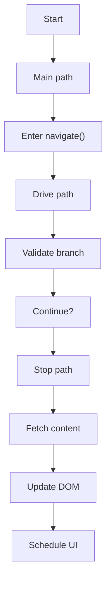
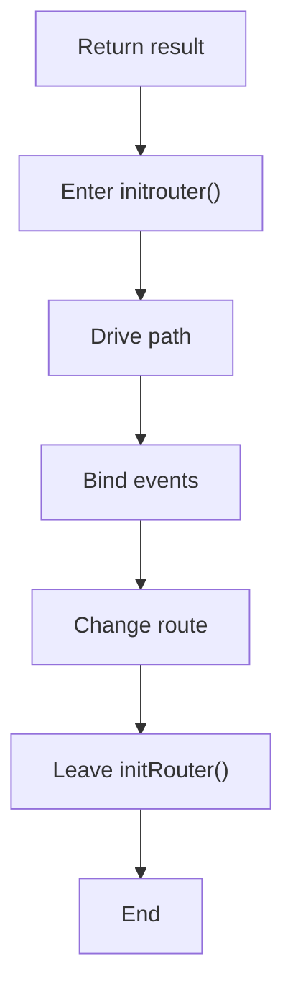
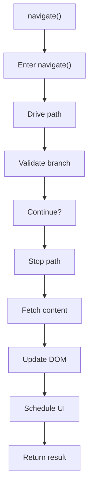
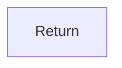
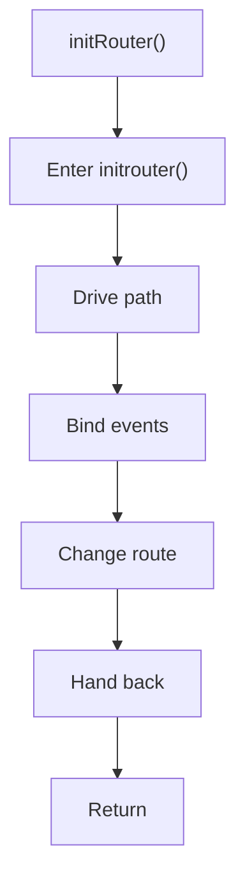

# router.js

- Source: Frontend/scripts/router.js
- Kind: JavaScript module
- Lines: 107

## Story
### What Happens Here

This file implements the client-side route transition loop. It reads the current hash, resolves the matching page fragment, fetches it, injects it into the shell, updates the nav state, and triggers page-specific initialization hooks. This script implements one piece of the frontend interaction model. It runs inside the browser after the SPA shell loads and updates the page in response to routing or user actions.

### Why It Matters In The Flow

Runs in the browser while the user navigates the prototype UI.

### What To Watch While Reading

Drives hash routing, fragment loading, and page-init hooks. The main surface area is easiest to track through symbols such as navigate, initRouter, ROUTES, and DEFAULT_ROUTE.

## Program Flow
This diagram follows the action path in plain words. Decision diamonds show where the file can stop, branch, or repeat work instead of simply passing through a straight line.

### Block 1 - Program Flow Details
#### Part 1

#### Part 2

## Reading Map
Read this file as: Drives hash routing, fragment loading, and page-init hooks.

Where it sits in the run: Runs in the browser while the user navigates the prototype UI.

Names worth recognizing while reading: navigate, initRouter, ROUTES, DEFAULT_ROUTE, currentPage, and contentEl.

## Story Groups

### Main Path
These steps drive the main execution path by calling the supporting work in order.
- navigate() (line 18): Drive the main execution path, validate conditions and branch on failures, and fetch route or page content
- initRouter() (line 92): Drive the main execution path, bind browser event listeners, and change the active route

## Function Stories

### navigate()
This routine owns one focused piece of the file's behavior. It appears near line 18.

Inside the body, it mainly handles drive the main execution path, validate conditions and branch on failures, fetch route or page content, and update DOM state.

The implementation iterates over a collection or repeated workload. It branches on runtime conditions instead of following one fixed path. The caller receives a computed result or status from this step.

What it does:
- drive the main execution path
- validate conditions and branch on failures
- fetch route or page content
- update DOM state
- schedule UI updates

Flow:

### Block 2 - navigate() Details
#### Part 1

#### Part 2

### initRouter()
This routine prepares or drives one of the main execution paths in the file. It appears near line 92.

Inside the body, it mainly handles drive the main execution path, bind browser event listeners, and change the active route.

What it does:
- drive the main execution path
- bind browser event listeners
- change the active route

Flow:

## Documentation Note
- This markdown file is part of the generated docs/Codebase mirror.
- It was generated from the repository state on 2026-04-23 after reading the existing docs corpus and the current source tree.
