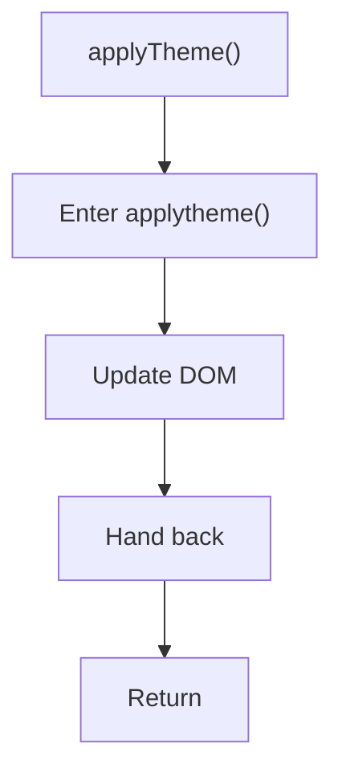

# applytheme.js

- Source document: [sidebar.js.md](../../sidebar.js.md)
- Purpose: decoupled implementation logic for a future code unit.

### applyTheme()
This routine owns one focused piece of the file's behavior. It appears near line 62.

Inside the body, it mainly handles update DOM state.

The implementation iterates over a collection or repeated workload.

What it does:
- update DOM state

Flow:

