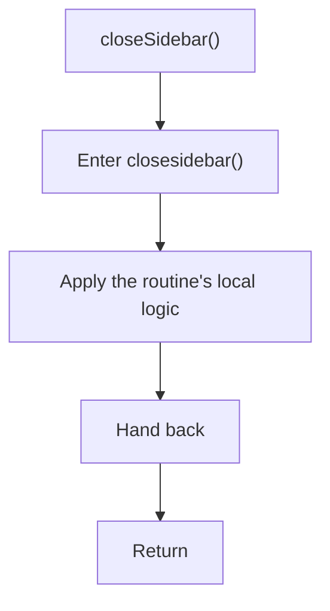

# closesidebar.js

- Source document: [sidebar.js.md](../../sidebar.js.md)
- Purpose: decoupled implementation logic for a future code unit.

### closeSidebar()
This routine owns one focused piece of the file's behavior. It appears near line 15.

What it does:
- This routine is primarily structural and does not expose obvious runtime operations from static inspection.

Flow:

