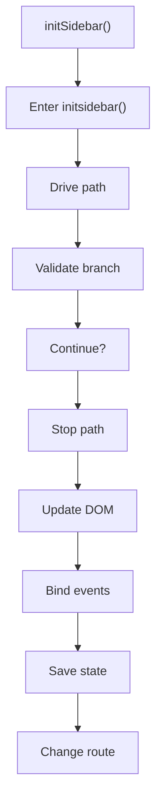
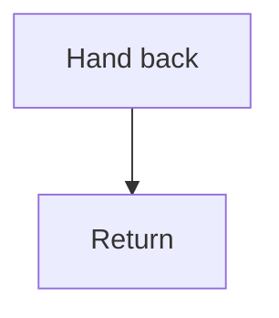

# initsidebar.js

- Source document: [sidebar.js.md](../../sidebar.js.md)
- Purpose: decoupled implementation logic for a future code unit.

### initSidebar()
This routine prepares or drives one of the main execution paths in the file. It appears near line 4.

Inside the body, it mainly handles drive the main execution path, validate conditions and branch on failures, update DOM state, and bind browser event listeners.

The implementation iterates over a collection or repeated workload. It branches on runtime conditions instead of following one fixed path.

What it does:
- drive the main execution path
- validate conditions and branch on failures
- update DOM state
- bind browser event listeners
- persist browser state
- change the active route

Flow:

### Block 2 - initSidebar() Details
#### Part 1

#### Part 2

