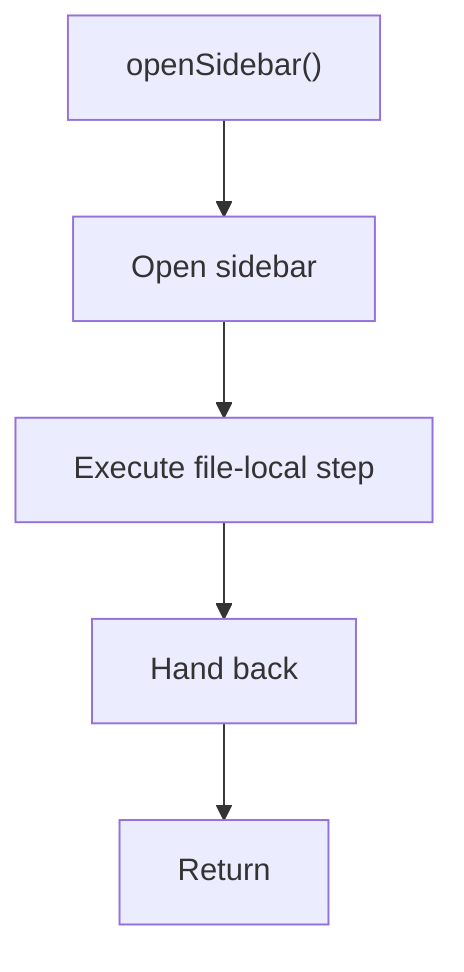

# opensidebar.js

- Source document: [sidebar.js.md](../../sidebar.js.md)
- Purpose: decoupled implementation logic for a future code unit.

### openSidebar()
This routine owns one focused piece of the file's behavior.

What it does:
- This routine is primarily structural and does not expose obvious runtime operations from static inspection.

Flow:

