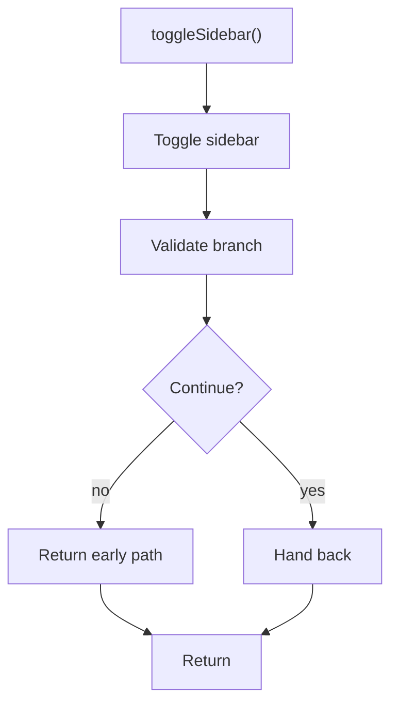

# togglesidebar.js

- Source document: [sidebar.js.md](../../sidebar.js.md)
- Purpose: decoupled implementation logic for a future code unit.

### toggleSidebar()
This routine owns one focused piece of the file's behavior.

Inside the body, it mainly handles validate conditions and branch on failures.

It branches on runtime conditions instead of following one fixed path.

What it does:
- validate conditions and branch on failures

Flow:

