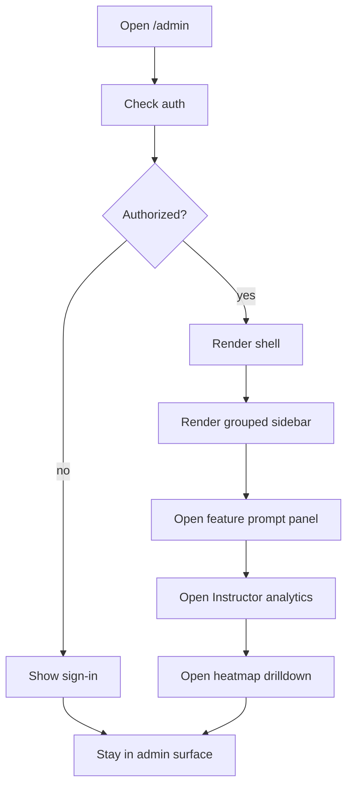

# `AdminApp.tsx`

## Sole job

Render the admin shell, enforce the admin sign-in gate, and host the grouped admin navigation. This is the persistent entry frame for the research dashboard, the Instructor tab, and the feature-release/prompt policy tools.

## Layout Goal

The shell should feel like a control room, not a generic settings page:

- one persistent grouped sidebar for sections and subsections
- a top status row for API / microservice / AI / online presence
- the Instructor area should keep its own drilldown path
- feature-release controls should be visually separate from instructor analytics

## Sidebar Rule

- Keep the sidebar grouped by concept, not just by raw route names.
- Use section headers, active-item highlighting, and nested drilldown cues.
- The concept should echo the learning-path navigation model: persistent, grouped, and progressive.
- Do not copy the learning-path visual style; copy the navigation logic only.

## Prompt Policy Rule

- Default every toggle to off.
- The prompt textbox should be the first control in the release-policy flow.
- Prompt output should produce a preview of what would turn on or stay off before save.
- Manual override should remain possible, but never implicit.

## Program Flow

## Top-Level Sections

### Operations

Keep runtime health and logs together. These items should stay close to the top because they answer "is the platform alive?"

### People

Keep users, invites, and join requests together. These items answer "who is in the system?"

### Instructor

Keep instructor analytics, course management, and question review together. These items answer "how are learners performing?"

### Research

Keep deep-dive analysis and legacy review surfaces together. These items answer "what needs manual inspection?"

### Config

Keep AI, catalogs, and release controls together. These items answer "what can the system change?"

## Implementation Notes

- The sidebar should remain mounted while tabs switch so the user does not lose context.
- Instructor navigation should be nested instead of flattening everything into one long panel.
- The feature-release/prompt flow should surface the current default-off state before any save action.
- Any heatmap drilldown should keep the sidebar visible so the user can move back to the summary without losing place.

## Acceptance Checks

- The admin shell renders one persistent grouped navigation rail.
- The current section remains highlighted during tab switches.
- Prompt-driven release policy starts from the off state.
- Instructor analytics keep a nested drilldown path for questions and modules.
- The shell does not collapse into a single flat settings page.
