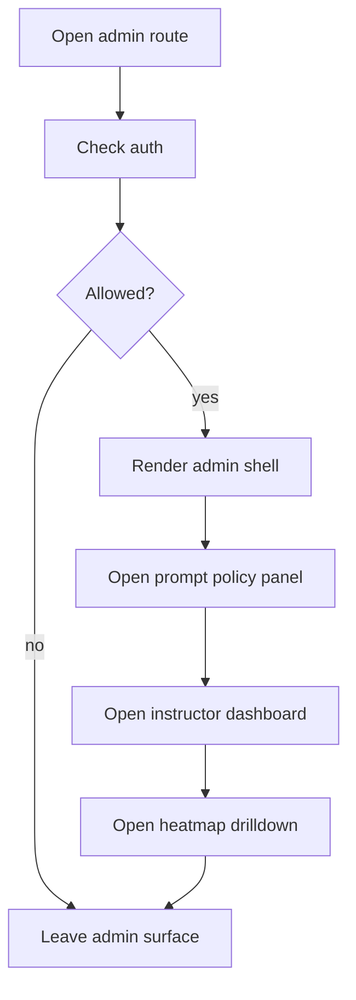

# admin

- Folder: docs/Codebase/Frontend/src/admin
- Owner: Frontend

## Logic Summary
Operator-facing admin shell for the Instructor analytics surface, feature-release control, and review tools. This folder owns the admin dashboard layout, the persistent section navigation, the prompt-driven toggle policy entrypoint, and the instructor heatmap drilldown. The Instructor course models themselves are publish/on-off records backed by pre-authored JSON question banks, not runtime question tagging.

## Ownership Boundary
This folder owns presentation, navigation, and request orchestration only. It must not own scoring math, feature-flag persistence, or question-result aggregation. Those belong to the backend admin endpoints and the shared admin data/logic contracts.

## Subsystem Story
Read the files in this order when tracing the admin side:
1. `AdminApp.tsx.md` - the shell, auth gate, status pills, and section navigation.
2. `components/FeatureReleasePanel.tsx.md` - prompt textbox plus default-off toggle policy.
3. `components/InstructorDashboard.tsx.md` - the Instructor sub-navigation and section switching.
4. `components/LearningAnalytics.tsx.md` - the per-question heatmap and drilldown.

## Folder Flow

## Navigation Contract

- The admin shell should keep one persistent sidebar with a file-tree layout.
- The sidebar should use nested groups and child items for `Operations`, `People`, `Instructor`, `Research`, and `Config`, matching the learner module sidebar's nesting model rather than its visual style.
- Each top-level group should expand into subsection items so the operator can navigate like a directory tree.
- The Instructor area should expose its own nested navigation so the analyst can move from summary to modules to question heatmap without losing context.
- Default-off feature toggles remain off until the operator explicitly applies the prompt-driven policy.
- Instructor modules should be flipped on or off at the module/model level; the question JSON is already tagged.

## Acceptance Checks

- The admin shell renders one persistent file-tree navigation rail.
- The sidebar keeps the active branch visible while the user changes panels.
- The Instructor area exposes a drilldown path for the heatmap instead of hiding everything behind a flat dashboard.
- The feature-release panel defaults to off for all toggles until a prompt or manual action changes them.
- The admin surface keeps prompt policy, analytics, and review tools separate.
- The Instructor analytics surface should not rely on runtime tagging to populate question labels.
