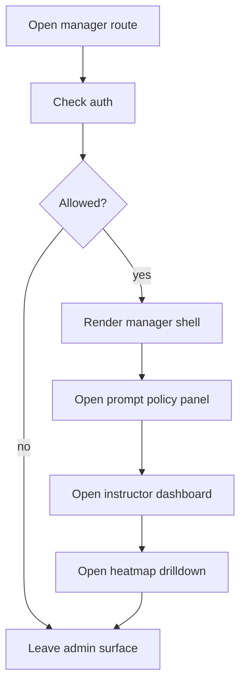

# admin

- Folder: docs/Codebase/Frontend/src/admin
- Owner: Frontend

## Logic Summary
Project Manager-facing shell for intern learning oversight, course planning, analytics, feature-release control, review tools, and responsive navigation. This folder owns the Project Manager dashboard layout, persistent section navigation, prompt-driven toggle policy entrypoint, analytics drilldown, and narrow-screen collapse rules. Internal `/admin` routes and API contracts remain unchanged implementation details.

## Ownership Boundary
This folder owns presentation, visible terminology, navigation, and request orchestration only. It must not own scoring math, authentication, authorization, feature-flag persistence, or question-result aggregation. Those belong to the existing backend endpoints and shared data/logic contracts.

## Subsystem Story
Read the files in this order when tracing the admin side:
1. `AdminApp.tsx.md` - the Project Manager shell, sign-in presentation, status rows, and section navigation.
2. `components/OverviewTab.tsx.md` - the learning overview, summary cards, and operational tables.
3. `components/FeatureReleasePanel.tsx.md` - prompt textbox plus default-off toggle policy.
4. `components/InstructorDashboard.tsx.md` - the analytics sub-navigation and section switching.
5. `components/LearningAnalytics.tsx.md` - the per-question heatmap and drilldown.
6. `components/ComplexityTab.tsx.md` - the saved-run complexity graphs and download actions.

## Folder Flow

## Navigation Contract

- The Project Manager shell keeps one persistent grouped sidebar.
- The primary navigation order is `Dashboard`, `Project Learning`, and `Learning Content`; technical utilities remain in a de-emphasized `Secondary Tools` branch.
- Each top-level group should expand into subsection items so the operator can navigate like a directory tree.
- The analytics area should expose its own drilldown so the Project Manager can move from intern summary to modules and question detail without losing context.
- Default-off feature toggles remain off until the operator explicitly applies the prompt-driven policy.
- Instructor modules should be flipped on or off at the module/model level; the question JSON is already tagged.
- Status indicators and account actions must occupy separate, aligned rows so controls do not scatter when they wrap.
- On mobile, the sidebar, status row, and account action row stack instead of squeezing into a horizontal strip.
- When the admin body collapses to a column, its children must stretch to the viewport width; wide tables should scroll inside their own wrappers rather than force the whole document wider.

## Acceptance Checks

- The shell uses Project Manager and Intern terminology in every visible label.
- The Project Manager shell renders one persistent grouped navigation rail.
- The sidebar keeps the active branch visible while the user changes panels.
- The Instructor area exposes a drilldown path for the heatmap instead of hiding everything behind a flat dashboard.
- The feature-release panel defaults to off for all toggles until a prompt or manual action changes them.
- The admin surface keeps prompt policy, analytics, and review tools separate.
- The Instructor analytics surface should not rely on runtime tagging to populate question labels.
- The Complexity tab owns its export controls and keeps them below the charts.
- Laptop layouts keep cards balanced and tables inside local horizontal scroll containers.
