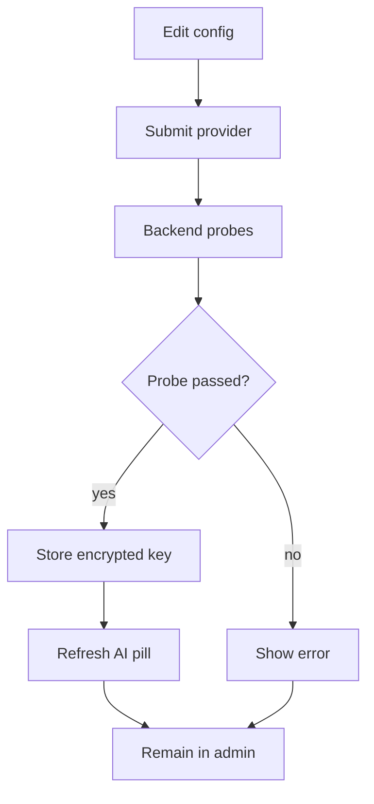

# `AiConfigPanel.tsx`

## Sole job

Render the admin form for runtime AI provider configuration. The panel edits provider, model, and API key, then relies on the backend to test provider reachability before the encrypted key is stored.

## Save Flow

## UI Contract

- A successful save means the backend has already received a basic response from the selected provider.
- The AI status pill is updated immediately from the save result, then reconciled with `/api/health`.
- Blank API-key input keeps the existing key only when the backend already has a key for the selected provider.
- The plaintext key is never echoed back to the browser.

## Acceptance Checks

- Saving bad provider credentials returns an error and does not show success.
- Saving valid credentials flips the AI pill out of `not configured` without waiting for the next heartbeat.
- Disabling AI clears the admin row and lets the backend fall back to environment-variable config.
