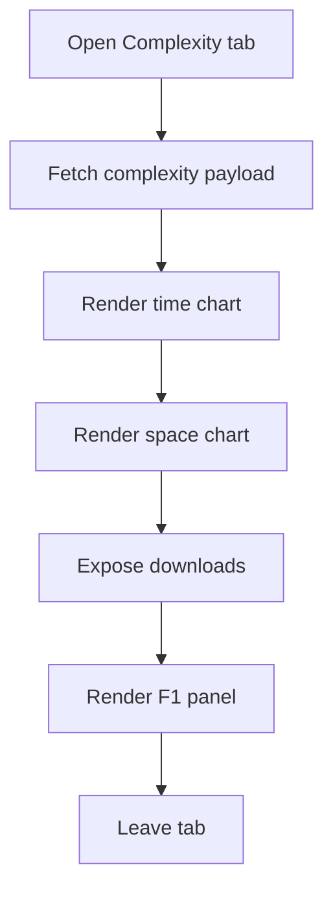

# ComplexityTab.tsx

- Source: `Frontend/src/admin/components/ComplexityTab.tsx`
- Kind: React component

## Story
### What Happens Here

This component renders the admin complexity view for saved analysis runs. It loads the complexity payload from `/api/admin/stats/complexity-data`, shows the time and space regressions, and exposes export controls at the bottom of the panel.

The export actions belong inside the Complexity tab itself, below the charts and above the F1 panel, so the operator can inspect the graph and download the same dataset in one place.

### Why It Matters In The Flow

The admin needs the raw per-run data, not just the fitted curves. The component keeps the charts for inspection and adds downloadable CSV/JSON output for offline analysis.

## Panel Flow

## Export Contract

- CSV exports one row per saved run.
- JSON exports the full endpoint payload, including regressions and raw points.
- Each point carries `runId`, `sourceName`, `createdAt`, `tokens`, `loc`, `patternCount`, `totalTargets`, `totalMs`, `items`, `serverWallUs`, and `analysisKb`.

## Acceptance Checks

- The download controls are rendered inside the Complexity tab, below the charts.
- CSV rows come from saved runs returned by the backend complexity endpoint.
- JSON preserves the regression results and raw points array.
- The export control does not move the run metrics into another admin section.
