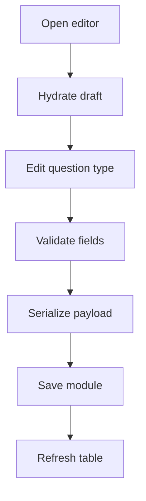

# `CourseEditor.tsx`

## Sole job

Render the admin create/edit form for one learning module and serialize the form back into the backend learning-module payload. This component owns draft state, validation copy, and type-specific controls for the mixed theoretical question bank.

## Question Editing Flow

## Mixed Bank Contract

- MCQ questions edit prompt, optional code, options, correct answer, taxonomy, and explanation.
- Identification questions edit prompt, scenario, expected tokens, taxonomy, and explanation.
- Studio questions edit prompt, target pattern slug, optional starter code, taxonomy, and explanation.
- Switching question type preserves the shared taxonomy and explanation fields.

## Ownership Boundary

The editor validates obvious authoring errors before save. It does not run learner grading, Studio analysis, course repair, or production seed regeneration.

## Acceptance Checks

- Existing non-MCQ questions hydrate into editable drafts instead of being dropped.
- Saving a module preserves question type, taxonomy, explanation, and type-specific fields.
- Invalid mixed questions show admin-side validation errors before the API call.
