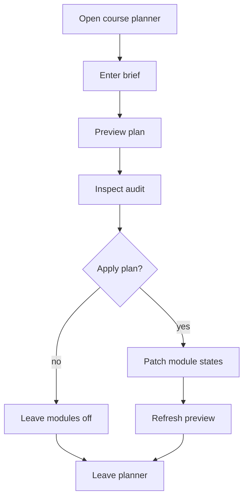

# `CoursePlanPanel.tsx`

## Sole job

Provide the admin course-planning prompt surface. This panel lets the operator type a project brief, preview the inferred course plan, inspect the pattern audit, and then apply the selected module toggles.

## Layout Goal

The panel should read like an operator tool, not a marketing card:

- prompt textbox at the top
- preview summary and diagnostics beneath it
- pattern audit visible inside the preview
- required-learning list and module board below the audit
- apply action separate from the preview

## Flow

## Preview Contract

- The preview shows whether the plan came from AI or the heuristic fallback.
- The diagnostics surface the current selection counts and any fallback reason.
- The pattern audit lists the strongest candidates, their scores, whether they were selected, and a short rejection reason when they were not.
- The preview stays visible until the operator clears the prompt or applies the plan.

## Acceptance Checks

- A blank prompt does not generate a preview.
- The diagnostics distinguish AI success from heuristic fallback.
- The pattern audit is visible in the admin preview, not hidden in a console-only log.
- The apply action only touches the modules that changed in the preview.
- Narrow viewports keep the prompt, audit, and module board readable without sideways scrolling.
