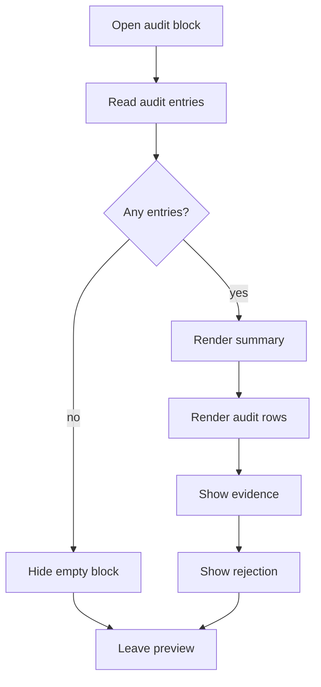

# `CoursePlanPatternAudit.tsx`

## Sole job

Render the reusable pattern-audit block inside the course-plan preview. This component owns only the audit subsection: pattern names, families, scores, selection state, evidence, and rejection reasons.

## Layout Goal

The audit should read like a compact operator checklist:

- show the `Pattern audit` summary open by default
- list each audited pattern with a score and selection state
- show the strongest evidence snippets first
- surface rejection reasons inline when a pattern is not selected

## Flow

## Rendering Contract

- The component is purely presentational.
- The list uses the same admin card and tag classes as the parent preview.
- The component returns `null` when no audit entries are present.
- Each row shows the pattern family, rounded score, selected/rejected state, and optional evidence or rejection text.

## Acceptance Checks

- Empty audit data does not render a stray wrapper.
- The audit block stays visually identical to the original course-plan preview section.
- The parent panel can import the component and pass the raw pattern-audit entries without reshaping them.
- Pattern evidence and rejection reasons remain inline and readable on narrow viewports.
