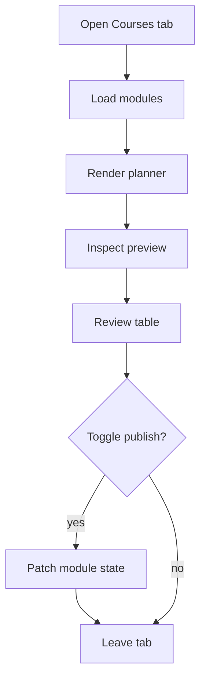

# `CoursesTab.tsx`

## Sole job

Render the admin learning CMS surface and host the course-plan preview above the table. This component owns the course list, row actions, publish state, normalized question-bank health, and the embedded planner panel that previews AI-enabled modules before the operator applies changes.

## Layout Goal

The tab should read like a compact operator console:

- course-plan preview at the top
- verification strip, audit, and module lists inside the preview
- course table below the planner
- row actions and publish lock copy kept in the table

## Flow

## Table Contract

- The planner sits inside the tab before the CMS table so the operator can preview a plan before editing rows.
- Locked foundation rows use `required` copy in the pill and tooltip, never `baseline`.
- The publish toggle still reflects the effective preview state when a plan is loaded.
- Loaded modules are normalized through the learner contract before table health is calculated or the editor opens.
- Sparse legacy theory banks should not show `Incomplete Bank` when normalization can provide all six Bloom levels.
- Seed rows remain protected from deletion; the table copy steers the operator toward unpublishing instead.
- The bulk On/Off save path uses the learner bulk route (`/api/learning/bulk`), so the tab can persist visibility without going through the admin CRUD endpoint.

## Acceptance Checks

- The planner preview renders above the table without breaking the admin tab layout.
- Row-level lock copy says `required`.
- Sparse legacy modules hydrate to a six-level theoretical bank before the table checks completeness.
- The publish toggle tooltip explains required rows with the same wording as the planner.
- Narrow screens keep the planner and table horizontally scrollable rather than clipped.
