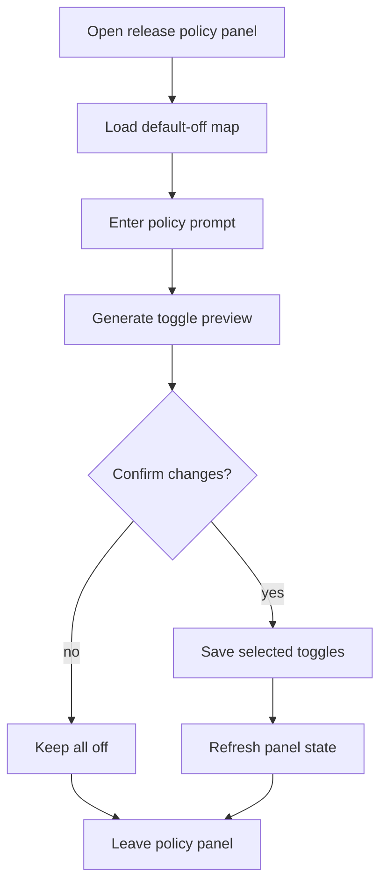

# `FeatureReleasePanel.tsx`

## Sole job

Provide the prompt-driven feature-release policy control. This panel is where an operator types a policy prompt, previews the inferred toggles, and then confirms what should stay off or turn on. Default state is off.

## Layout Goal

The panel should read like a policy editor, not a basic checkbox list:

- prompt textbox at the top
- generated toggle preview beneath it
- explicit off/on state for every item
- confirmation action separate from the preview

## Policy Rule

- The system must start from implicit deny.
- Nothing turns on unless the prompt-driven policy or a manual override explicitly enables it.
- The default view should show every unreleased flag as off.
- The operator should be able to see both the raw prompt and the generated toggle plan before saving.

## Program Flow

## Surface Sections

### Prompt Box

The prompt box is the first control the operator sees. It should accept the policy brief in plain language, for example:

- what should be enabled for the current release
- what must remain disabled
- whether a toggle is project-specific, role-specific, or global

### Toggle Preview

Show the inferred flags as a preview list before save. Each row should state:

- flag key
- inferred state
- why it was enabled or kept off

### Manual Override

Keep a manual override path in case the operator does not trust the prompt result. The override must still start from off and only enable what is explicitly chosen.

## Implementation Notes

- Load the current release map with all flags defaulted to off.
- Treat prompt output as a preview until the operator confirms the save.
- Keep the prompt text visible after save so the operator can audit what drove the change.
- If the prompt is blank, do not auto-enable anything.

## Acceptance Checks

- The panel opens with every toggle off by default.
- A prompt entry produces a preview before any save is committed.
- The operator can keep an item off even when the preview suggests it.
- The saved state remains auditable through the original prompt text.
