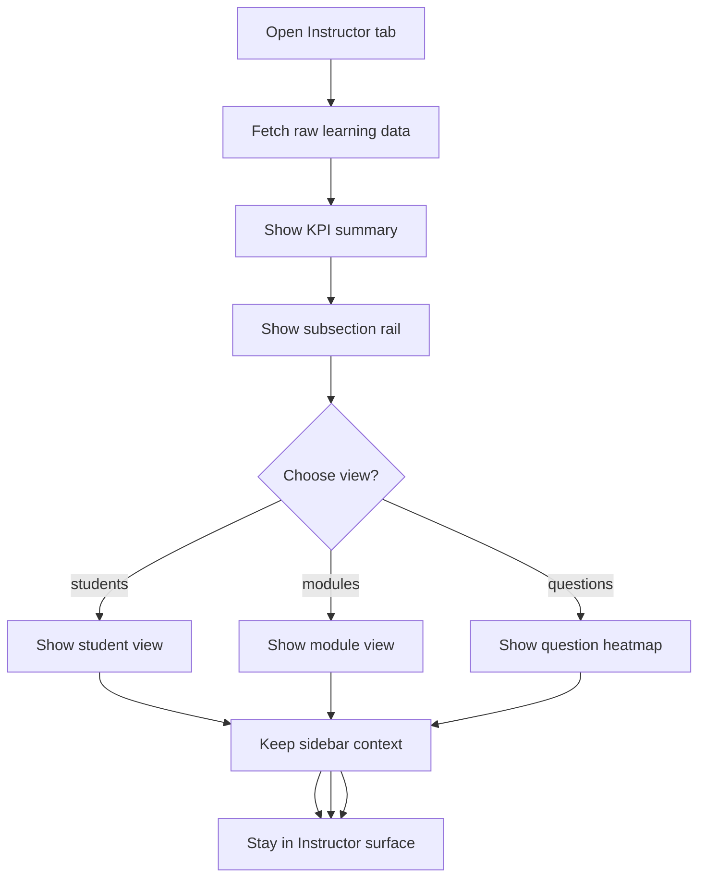

# `InstructorDashboard.tsx`

## Sole job

Render the Instructor analytics surface and its nested navigation. This component owns the student summary, module difficulty view, and question heatmap entry points, but it should not flatten them into one undifferentiated page.

## Layout Goal

The Instructor surface should feel navigable like a file tree:

- a persistent subsection rail
- one active branch at a time
- a clear drilldown path from summary to modules to questions
- no need to scroll through unrelated analytics to get to the heatmap
- module publish state should be visible as on/off, while question tags are already present in the module JSON

## Navigation Rule

- Use a nested control model, not a one-row segmented toggle.
- Keep the section labels stable so users can orient themselves quickly.
- The active subsection should remain obvious even when the content area changes.
- Moving from summary to heatmap should not reset the user’s context.

## Program Flow

## Subsections

### Students

The student view should answer who is progressing, who is stalled, and who is ready.

### Modules

The module view should answer which module is hardest, how the ranking compares across the curriculum, and which modules are currently on or off in the model-backed course catalog.

### Questions

The question view should answer where the heatmap is strongest or weakest and expose drilldown into individual answers.

## Implementation Notes

- Keep the raw-data fetch shared across the Instructor subviews.
- Switching subviews should not clear the nav context.
- The sub-navigation should follow the same structural rule as the learning-path sidebar: file-tree nesting, persistent branches, and active-state driven highlighting.
- The heatmap view should keep the rest of the Instructor context accessible so the user can step back without losing the analytics frame.
- Do not add a runtime tagging step here; the JSON question tags already exist in the catalog and the Instructor area only consumes them.

## Acceptance Checks

- The Instructor section exposes one persistent file-tree navigation model.
- The user can move from student summary to modules to heatmap without losing context.
- Raw data is fetched once and reused across subviews.
- The heatmap remains reachable as a distinct subsection, not as an embedded afterthought.
- The module list uses explicit on/off publish state instead of runtime tagging to determine visibility.
