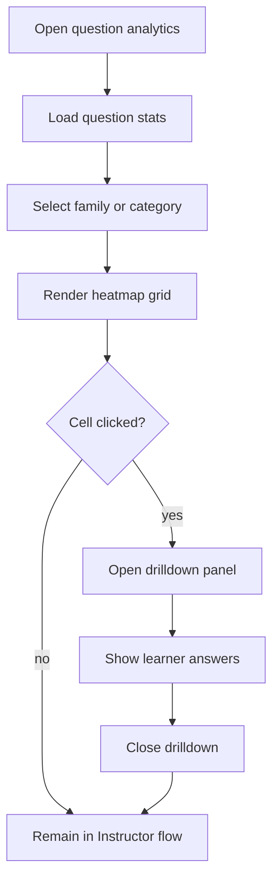

# `LearningAnalytics.tsx`

## Sole job

Render the question heatmap and the question-level drilldown for the Instructor surface. This is the per-question analytics view: first-try pass rates, module rows, question columns, and a detail panel for learner answers.

## Layout Goal

The view should make the heatmap readable first and the drilldown secondary:

- family or category selector on the side or top as a stable navigator
- heatmap grid in the main body
- question detail panel only when the user clicks a cell
- keep the raw learner answers visible in the drilldown

## Heatmap Rule

- Each cell represents first-try pass rate for one module/question pair.
- Empty cells remain empty, not fake zeroes.
- Disabled cells should still preserve the grid alignment.
- The heatmap should stay fast to scan even when there are many modules.

## Drilldown Rule

- Clicking a populated cell opens a detail view for that specific question.
- The detail view should show learner names, selected answers, first-try correctness, and attempt counts.
- The view should close cleanly and return the user to the same place in the heatmap.

## Program Flow

## Visual Rules

- Keep the heatmap cells compact and readable.
- Keep the selected group visible while the user drills into a cell.
- Use the colour scale only as a score cue; the exact percentage should stay visible.
- The heatmap should not become a hidden detail pane behind the dashboard shell.

## Implementation Notes

- Resolve question text from the course catalog, not from stored analytics rows.
- Keep the drilldown anchored to the exact cell the user clicked.
- Preserve the current group selection when the drilldown closes.
- The sidebar/rail concept should feel like the learning-path navigation model, but it should stay visually aligned with the Instructor dashboard theme.

## Acceptance Checks

- The heatmap shows module-by-question pass rates.
- Empty cells do not pretend to contain data.
- Clicking a populated cell opens the learner answer drilldown.
- Closing the drilldown returns the user to the same heatmap context.
