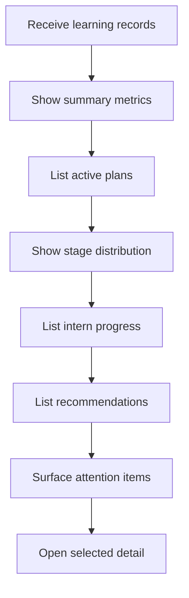

# `OverviewTab.tsx`

## Sole job

Present the Project Manager's at-a-glance intern learning view without changing how records, recommendations, assessment cycles, or suggested actions are derived.

## Ownership boundary

This component owns visible section names, summary-card grouping, table presentation, and action placement. It consumes existing derived records and callbacks. Recommendation logic, scoring, persistence, routing, and authorization stay outside this file.

## Main activity

## Presentation rules

- Use `Intern` consistently in visible labels, hints, table headings, and accessibility labels.
- Keep summary metrics in one responsive grid with consistent card height, padding, and numeric scale.
- Keep section headers compact and place the primary section action at the right edge when space permits.
- Wrap every wide table in its local scroll container; the page itself must not overflow horizontally.
- Keep badges and module chips compact, readable, and separated from adjacent values.
- Use the shared CodiNeo cyan, teal, and green tokens rather than introducing a dashboard-only palette.

## Acceptance checks

- The shell heading reads `Project Manager Dashboard`, while this panel reads `Learning Overview` to avoid duplicate titles.
- The recommendation section reads `Intern Module Recommendations`.
- Active plan copy refers to intern-level plans.
- Summary cards align on a normal laptop viewport.
- Table actions remain consistently sized and aligned.
- Empty, loading, and error states preserve their existing behavior.
