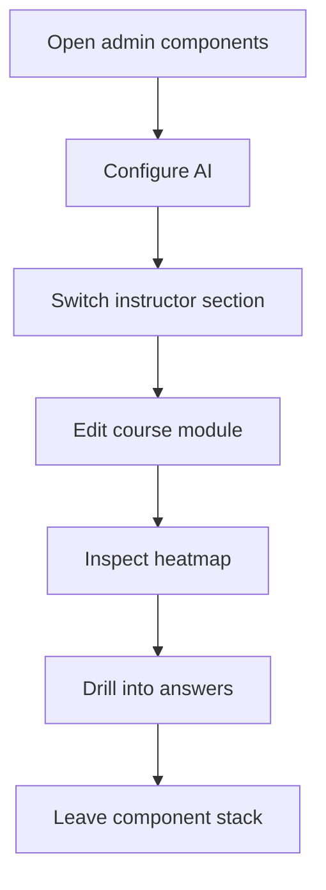

# components (admin)

- Folder: docs/Codebase/Frontend/src/admin/components
- Owner: Frontend

## Logic Summary
Project Manager panels that power the shell navigation, intern overview, feature-release prompt control, learning analytics, and responsive operator layouts. Learning content is model-backed and already tagged in JSON; this presentation layer turns modules on or off, edits mixed question-bank rows, and reads prepared question data.

## Subsystem Story
Read the component docs in this order:
1. `OverviewTab.tsx.md` - summary metrics, intern progress, recommendations, and attention items.
2. `AiConfigPanel.tsx.md` - tested runtime AI provider configuration.
3. `FeatureReleasePanel.tsx.md` - prompt textbox and explicit default-off toggle preview.
4. `CoursePlanPanel.tsx.md` - the prompt-driven course scope preview and apply flow.
5. `CoursePlanPatternAudit.tsx.md` - the reusable pattern audit block embedded in the preview.
6. `CoursesTab.tsx.md` - the course CMS table, planner embedding, required badge copy, and bank health.
7. `CourseEditor.tsx.md` - the module editor and mixed theoretical question bank form.
8. `InstructorDashboard.tsx.md` - the analytics section shell and nested navigation.
9. `LearningAnalytics.tsx.md` - the question heatmap and drilldown table.
10. `ComplexityTab.tsx.md` - the saved-run complexity graphs and export controls.

## Folder Flow

## Acceptance Checks

- Prompt-driven toggle control stays separate from instructor analytics.
- AI configuration saves are provider-tested before the panel reports success.
- Course-plan preview keeps its audit block isolated in a dedicated component.
- The planner verification strip appears before the audit and clearly separates verified, fallback, and failed states.
- The top planner board only shows AI-enabled non-foundation modules; required modules stay in their own section below.
- Instructor navigation stays separate from heatmap detail rendering.
- Heatmap drilldown remains readable after the sidebar redesign.
- Question tagging comes from the module JSON, not from a runtime tagging step in the Instructor UI.
- The course editor preserves MCQ, identification, and Studio question types.
- Course planning stays preview-first, and the diagnostic audit explains why a pattern was picked or rejected.
- Required module copy uses "required" rather than "baseline" anywhere the planner or course table shows locked foundations.
- Complexity export controls stay inside the Complexity tab, below the charts, and export the saved-run dataset rather than a synthetic summary.
- Narrow viewports keep action rows, downloads, and tables legible instead of forcing sideways page scrolling.
- All visible role and participant labels use Project Manager and Intern terminology.
