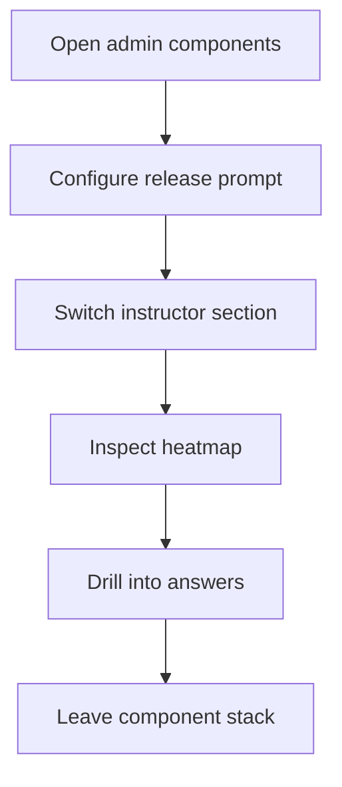

# components (admin)

- Folder: docs/Codebase/Frontend/src/admin/components
- Owner: Frontend

## Logic Summary
Admin-side panels that power the shell-level navigation, feature-release prompt control, and instructor analytics surfaces. Instructor learning content is model-backed and already tagged in JSON; the admin layer only turns modules on or off and reads the prepared question data.

## Subsystem Story
Read the component docs in this order:
1. `FeatureReleasePanel.tsx.md` - prompt textbox and explicit default-off toggle preview.
2. `InstructorDashboard.tsx.md` - the Instructor section shell and its nested navigation.
3. `LearningAnalytics.tsx.md` - the question heatmap and drilldown table.

## Folder Flow

## Acceptance Checks

- Prompt-driven toggle control stays separate from instructor analytics.
- Instructor navigation stays separate from heatmap detail rendering.
- Heatmap drilldown remains readable after the sidebar redesign.
- Question tagging comes from the module JSON, not from a runtime tagging step in the Instructor UI.
