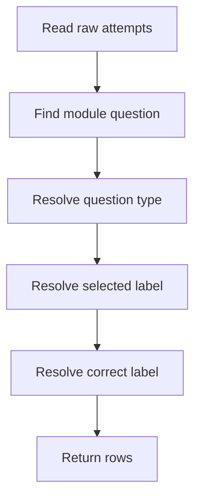

# `learningAggregate.ts`

## Sole job

Aggregate instructor analytics from raw learning telemetry and join it back to the learning catalog for display. It calculates heatmap values, module summaries, and student drilldown rows without rewriting the underlying course content.

## Drilldown Flow

## Mixed Question Labels

- MCQ rows display option text for selected and correct answers.
- Identification rows display learner response labels and expected tokens.
- Studio rows display analyzer response labels and the target pattern slug.
- Unknown catalog rows fall back to neutral placeholders instead of pretending to be MCQ.

## Acceptance Checks

- Heatmap aggregation remains numeric and type-independent.
- Student drilldown rows include the question type.
- Non-MCQ questions do not display fake `Option 1` style correct-answer labels.
