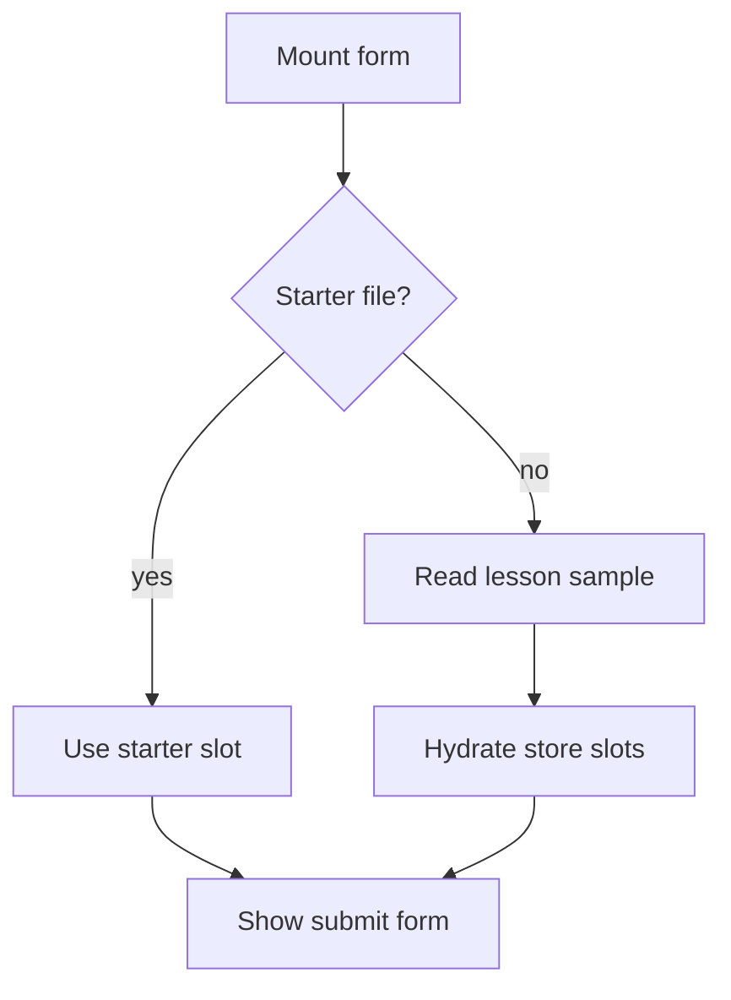

# `AnalysisForm.tsx`

## Sole job

Own the code-submission form used by the Studio analyzer. It manages file slots, submission limits, feature-gated analysis behavior, and the bridge into the shared analysis store.

## Initial File Flow

## Embedded Learning Rule

When a learning Studio question provides an `initialFile`, that file seeds the first slot before session-storage samples or previous store state. This keeps a creating-level assessment focused on the authored starter code.

## Acceptance Checks

- Embedded Studio checks can open with a named starter file.
- Normal Studio usage still falls back to lesson samples or stored source text.
- Analysis submission behavior remains owned by this form, not by the learning question renderer.
