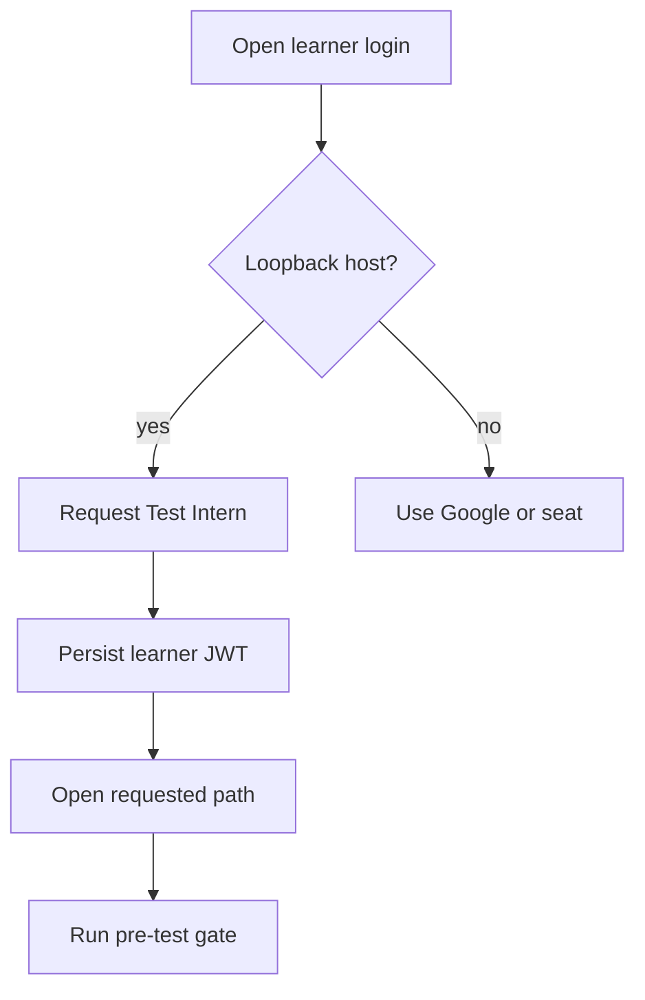

# GoogleSignInPage.tsx

- Source: `Frontend/src/components/auth/GoogleSignInPage.tsx`
- Kind: authentication entry surface

## Story

This page chooses the available sign-in action for learner, admin, PM, and onboarding routes. Learners on `localhost` or `127.0.0.1` receive `Continue as Test Intern`; deployed hosts keep the shared-seat and Google behavior.

## Local Learner Flow

## Boundaries

- The frontend cannot create the local account directly; it calls `/auth/test-intern`.
- Only `/pre-test` and Learner Path destinations are accepted from the `next` query.
- The backend owns the production deny rule.
- The Test Intern is a normal learner account, so assessment and progress persistence use the existing APIs.

## Acceptance Checks

- Local learner access does not depend on Supabase or an available Devcon seat.
- Successful access enters the requested pre-test or Learner Path flow.
- Reloading preserves the session through the normal learner store.
- Deployed hosts do not display the local-only button.
