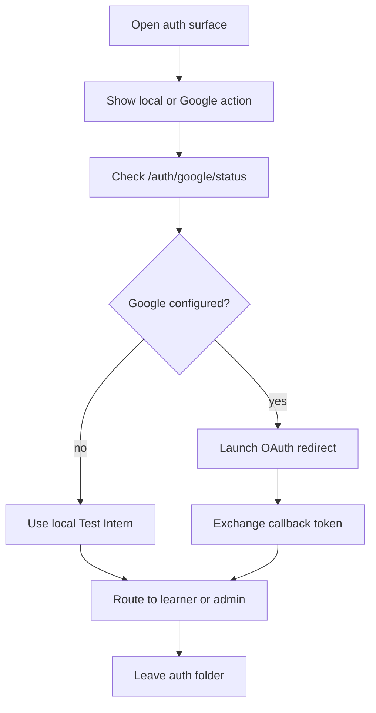

# auth

- Folder: docs/Codebase/Frontend/src/components/auth
- Descendant source docs: 0

## Logic Summary
Browser auth surfaces for learner, admin, PM, and first-time onboarding flows. This folder owns the visible sign-in card, the local Test Intern entry, the guest-seat entry, the Google OAuth launch button, the callback landing, and the onboarding handoff after a successful exchange.

## Ownership Boundary
This folder owns presentation and routing decisions only. It must not own seat allocation, Google token verification, or database writes. Those belong to the backend auth routes and controllers.

## Subsystem Story
Read the pages in this order when tracing a local sign-in problem:
1. `GoogleSignInPage.tsx` - renders the learner/admin/PM entry surface and the guest-seat button.
2. `GoogleSignInButton.tsx` - checks Google availability and launches Supabase OAuth.
3. `GoogleCallback.tsx` - exchanges the OAuth token for the local app JWT and chooses the next route.
4. `OnboardingFlow.tsx` - handles the post-sign-in setup branch when the backend asks for onboarding.

## Folder Flow

## Local Dev Warning
On `localhost` and `127.0.0.1`, learner sign-in shows `Continue as Test Intern`. This path does not consume a shared Devcon seat and does not require Supabase. It provisions one stable local learner account so pre-test and learning progress survive refreshes.

## Deployment Warning
`/auth/callback` is not a backend API route. Supabase returns the OAuth token in the browser
hash, so Vercel must serve the SPA entry for that path before the broad `/auth/*` backend
proxy. Only follow-up endpoints such as `/auth/google/status` and `/auth/google/exchange`
should proxy to Express.

## Implementation Note
- Guest seats are real rows in SQLite; the button should only read them through `/auth/test-accounts`.
- Local Test Intern access calls `/auth/test-intern` only on loopback frontend hosts.
- Google sign-in should stay hidden when `/auth/google/status` is unavailable or unconfigured, but the route itself must not fail because the frontend cannot reach the backend.

## Acceptance Checks
- Learner sign-in shows guest seats when the backend is reachable.
- Local learner sign-in works when Google is unavailable and every shared seat is claimed.
- The local Test Intern session routes into the Learner Path gate and then the pre-test.
- Reloading preserves the local Test Intern JWT and learner identity.
- The Google button appears only when the backend reports Google auth configured.
- Callback navigation lands on the learner path after token exchange.
