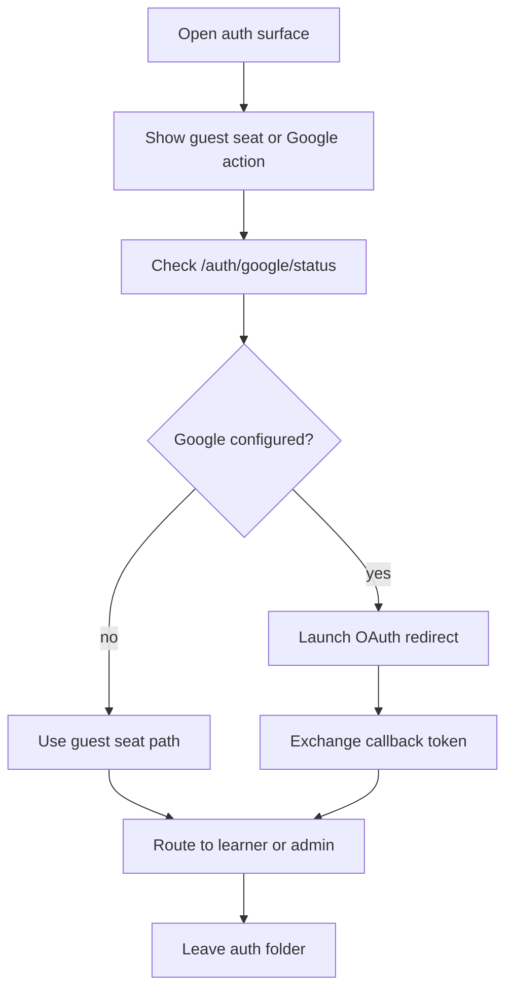

# auth

- Folder: docs/Codebase/Frontend/src/components/auth
- Descendant source docs: 0

## Logic Summary
Browser auth surfaces for learner, admin, PM, and first-time onboarding flows. This folder owns the visible sign-in card, the guest-seat entry, the Google OAuth launch button, the callback landing, and the onboarding handoff after a successful exchange.

## Ownership Boundary
This folder owns presentation and routing decisions only. It must not own seat allocation, Google token verification, or database writes. Those belong to the backend auth routes and controllers.

## Subsystem Story
Read the pages in this order when tracing a local sign-in problem:
1. `GoogleSignInPage.tsx` - renders the learner/admin/PM entry surface and the guest-seat button.
2. `GoogleSignInButton.tsx` - checks Google availability and launches Supabase OAuth.
3. `GoogleCallback.tsx` - exchanges the OAuth token for the local app JWT and chooses the next route.
4. `OnboardingFlow.tsx` - handles the post-sign-in setup branch when the backend asks for onboarding.

## Folder Flow

## Local Dev Warning
If the browser says there are no guest seats, or the Google button disappears, the first thing to verify is the local backend proxy path. The UI can only see the seat data and Google status if `/auth/*` reaches the live backend process.

## Implementation Note
- Guest seats are real rows in SQLite; the button should only read them through `/auth/test-accounts`.
- Google sign-in should stay hidden when `/auth/google/status` is unavailable or unconfigured, but the route itself must not fail because the frontend cannot reach the backend.

## Acceptance Checks
- Learner sign-in shows guest seats when the backend is reachable.
- The Google button appears only when the backend reports Google auth configured.
- Callback navigation lands on the learner path after token exchange.
