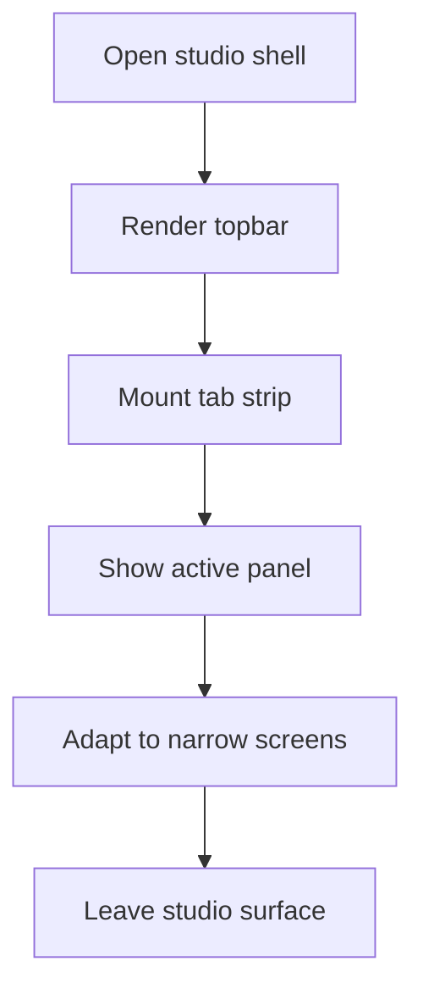

# layout components

- Folder: docs/Codebase/Frontend/src/components/layout
- Owner: Frontend

## Logic Summary
Shared shell components for the studio workspace. This folder owns the persistent studio frame, the topbar, the tab-strip container, and the guard rails that keep the analysis workspace readable across desktop and mobile widths.

## Ownership Boundary
This folder owns layout and orchestration only. It must not own analysis logic, scoring, pattern inference, or persistence. Those remain in the analysis form, tab components, backend routes, and shared stores.

## Reading Order
1. `MainLayout.tsx.md` - the outer studio shell and topbar.
2. `StudioSurface.tsx.md` - the tab strip and the active analysis panel stack.

## Responsive Contract

- The shell padding should tighten on narrow screens without changing the desktop frame.
- The studio topbar should stack cleanly before its actions start to overflow horizontally.
- The tab strip should stay scrollable on touch devices instead of wrapping into unreadable rows.
- Result panes and analysis panels should reflow to one column before the page gets wider than the viewport.

## Folder Flow

## Acceptance Checks

- The shell stays centered and readable at phone widths.
- The tab strip remains usable with horizontal scroll instead of line wrapping.
- The active analysis pane reflows without creating page overflow.
