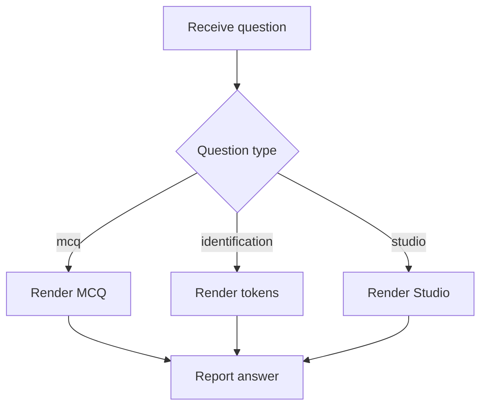

# `BloomQuestionRenderer.tsx`

## Sole job

Render one Bloom-tagged theoretical question in the learner UI. It chooses the correct control surface for MCQ, identification, or Studio code-check questions and reports the learner answer through a single callback shape.

## Render Flow

## Studio Boundary

Studio questions pass `targetPatternSlug` and optional `starterCode` into `StudioSurface`. Detection success is reported as the learner answer; the renderer does not run pattern analysis itself.

## Acceptance Checks

- MCQ, identification, and Studio questions render from the same theoretical bank.
- Studio creating questions can preload starter code into the embedded analysis form.
- Result display follows the answer state passed by the parent assessment surface.
