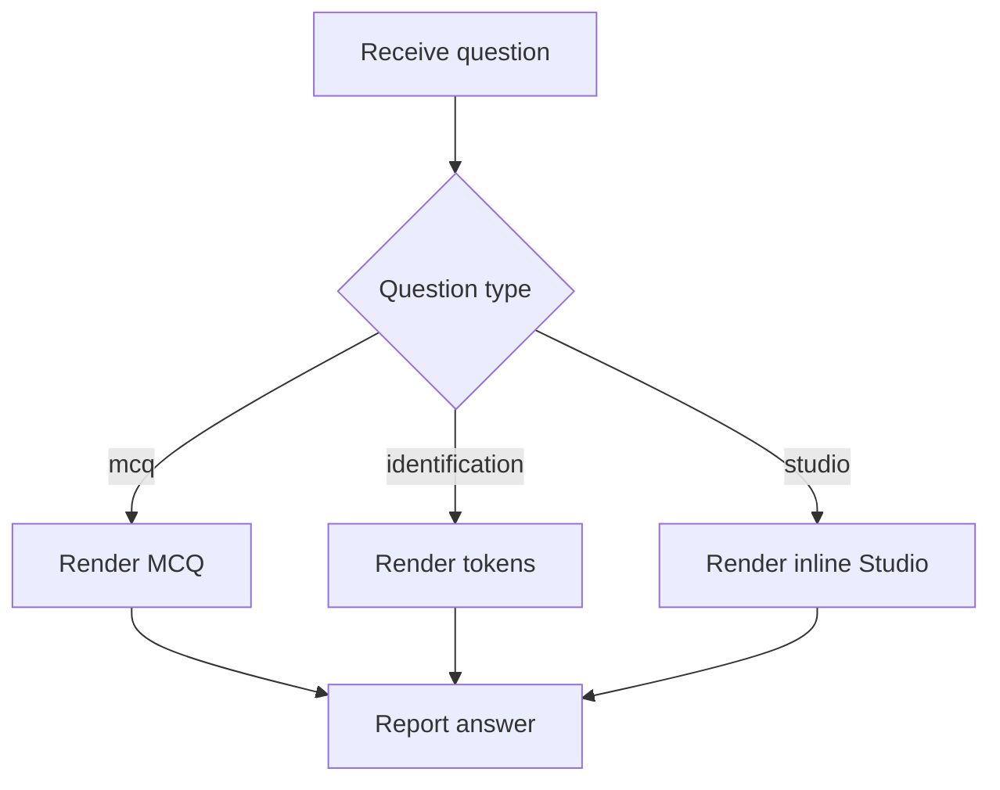

# `BloomQuestionRenderer.tsx`

## Sole job

Render one Bloom-tagged theoretical question in the learner UI. It chooses the correct control surface for MCQ, identification, or Studio code-check questions and reports the learner answer through a single callback shape. Studio questions render inline as an always-open embedded Studio frame, not as a modal or blur overlay.

## Render Flow

## Studio Boundary

Studio questions pass `targetPatternSlug` and optional `starterCode` into `StudioSurface`. Detection success is reported as the learner answer; the renderer does not run pattern analysis itself. The embedded Studio stays visible after detection so the learner can inspect Patterns or Tests without reopening anything. When the localhost dev release flag is enabled, the surface can also expose a tiny skip button that completes the same answer path.

## Acceptance Checks

- MCQ, identification, and Studio questions render from the same theoretical bank.
- Studio creating questions can preload starter code into the embedded analysis form.
- Studio creating questions do not show an "Open Studio" button and do not mount a modal overlay.
- Local dev can skip a Studio question through the inline surface when the `assessment-dev-tools` flag is on.
- Result display follows the answer state passed by the parent assessment surface.
