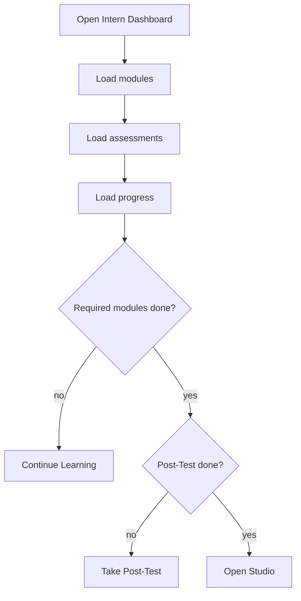

# `InternDashboard.tsx`

## Sole job

Render the intern's central learning checkpoint after the Pre-Test. The dashboard combines saved assessment history with learning progress to show the Pre-Test standing, required modules, Post-Test readiness, and final Studio access.

## Program flow

## Surface sections

- Pre-Test standing with raw correct count and percentage.
- Count of modules recommended for study from the Pre-Test.
- Completed and remaining required modules.
- Category progress and recent module state.
- One primary next action:
  - `Continue Learning`
  - `Take Post-Test`
  - `Open Studio`

## Ownership boundary

- `deriveInternLearningStatus(...)` owns the shared gate calculation.
- This component owns dashboard presentation and navigation only.
- Backend routes remain the source of persisted assessment and progress records.

## Acceptance checks

- A saved Pre-Test routes to and renders on the Intern Dashboard.
- The dashboard shows the intern's Pre-Test score and required-module count.
- Continue Learning opens the Learning Path while required modules remain.
- Post-Test becomes the primary action after required modules are complete.
- Studio becomes available only after the paired Post-Test is complete.
