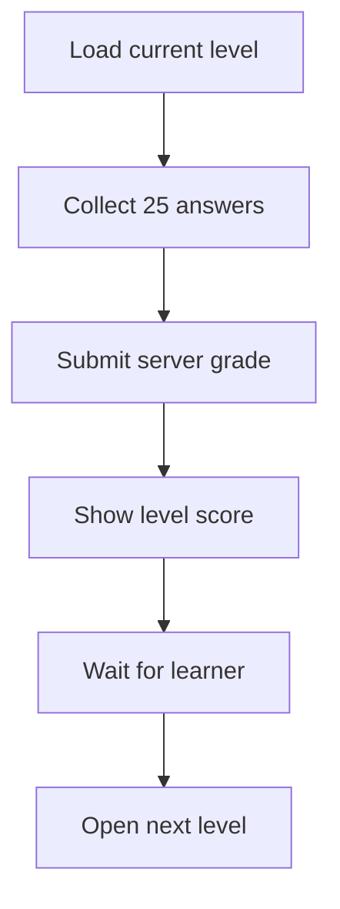
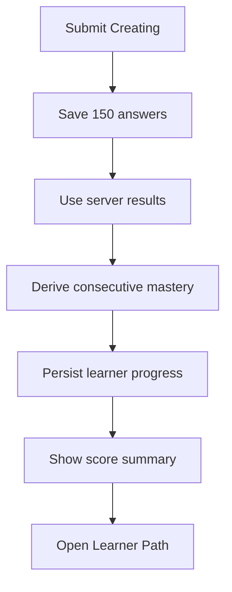

# LearningAssessmentPage.tsx

- Source: `Frontend/src/components/learn/LearningAssessmentPage.tsx`
- Kind: learner assessment route

## Story

This component owns the learner pre-test sequence. The pre-test always presents the six Bloom taxonomy levels in order. Each level contains the full published 25-question bank, receives an authoritative server grade, shows its own score, and waits for the learner to choose `Proceed to Next Level`.

The final level saves one complete 150-answer assessment, shows a six-level score summary, persists consecutive per-module Bloom mastery, and returns the learner to the safe `next` Learner Path URL.

## Level Submission Flow

Each level is deliberately separated from final persistence so the learner can review the score before advancing.

## Finalization Flow

## Persistence Boundary

- The in-progress level, answer map, and completed level grades use a user-and-session-scoped local draft.
- A refresh restores the current Bloom level and already submitted scores.
- Answered progress is derived from actual non-empty learner responses, never from the number of submitted records.
- Server `totalCount` remains the score denominator and is not reused as answered progress.
- The draft is cleared only after the backend accepts the complete assessment.
- Unanswered questions are serialized with an invalid answer and count as incorrect.
- The server grade, not a client answer key, decides correctness and mastery.

## Recommendation Boundary

- Mastery is consecutive: a learner must pass Remembering before Understanding can increase the module mastery level.
- A correct higher-level answer cannot erase a lower-level weakness.
- The Learner Path uses the saved mastery map to put weaker modules first, omit fully mastered modules, and hide already-mastered quiz pages.

## Acceptance Checks

- Every pre-test Bloom level renders 25 questions.
- Every Bloom card labels `Answered` separately from `Score`.
- Submitted levels preserve their actual answered count even though unanswered rows are graded as incorrect.
- Submission stays on the pre-test page and shows only the current level score.
- The next questionnaire opens only after `Proceed to Next Level`.
- All six level scores appear in the final summary.
- The final summary shows both answered progress and score for every level.
- Final persistence contains 150 answers.
- Refreshing before completion restores the draft.
- Completion returns to `/patterns/learn` or a validated Learner Path `next` URL.
- A learner-session 401 routes to learner sign-in instead of the marketing landing page.
