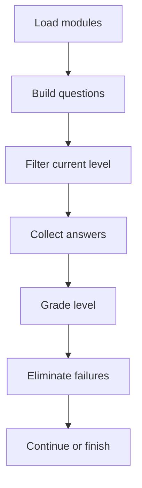
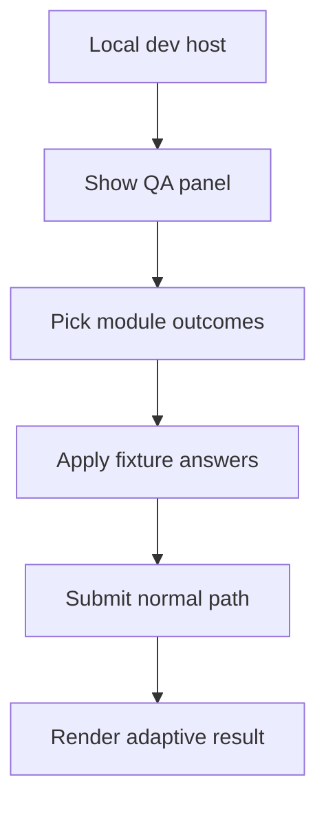

# LearningAssessmentPage.tsx

- Source: `Frontend/src/components/learn/LearningAssessmentPage.tsx`
- Kind: learner assessment route

## Story
This component renders the pre-test, post-test, and post-test-2 pages. It owns the current answer map, delegates question rendering to `BloomQuestionRenderer`, grades through `learningAssessments.ts`, and advances the adaptive Bloom pre-test by removing modules that fail the current level.

The page also contains a visible localhost-only QA panel. The panel appears only in Vite dev mode on `localhost`, `127.0.0.1`, or `::1`. It lets a developer mark current-level modules as pass or fail, apply fixture answers, submit the level, and continue to the next adaptive state without exposing a production bypass.

## Flow

## QA Flow

## Boundary
- The normal submit path remains the source of truth for grading and persistence.
- The QA panel does not render in production builds.
- Module elimination still runs through `eliminateModules()` from `AdaptiveAssessmentProvider`.
- The page does not own the question-bank shape; that stays in `learningAssessments.ts` and `learningModules.ts`.

## Acceptance Checks
- Local dev can mark current modules as pass or fail and submit through the same grading path.
- Wrong modules are removed from the active module pool after a pre-test level is submitted.
- Non-localhost production users never see the QA controls.
