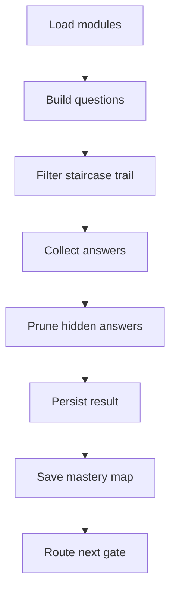
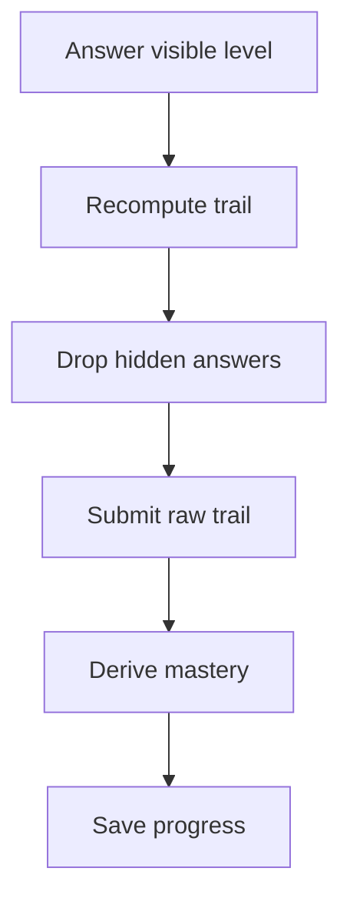

# LearningAssessmentPage.tsx

- Source: `Frontend/src/components/learn/LearningAssessmentPage.tsx`
- Kind: learner assessment route

## Story
This component renders the Pre-Test, Post-Test, and legacy post-test-2 pages. It owns the current answer map, delegates question rendering to `BloomQuestionRenderer`, grades through `learningAssessments.ts`, and enforces the intern flow around the assessment cycle.

For the Pre-Test, the page renders the strict Bloom staircase returned by `filterPretestStaircaseQuestions(...)`: each module starts at the first authored level, passing a level reveals the next one, and failing a level hides later levels for that module.

## Flow

## Pre-Test Mastery Flow

## Boundary
- The normal submit path remains the source of truth for grading and persistence.
- The page does not own the question-bank shape; that stays in `learningAssessments.ts` and `learningModules.ts`.
- Studio questions still complete through the always-open embedded Studio frame rendered by `BloomQuestionRenderer`.
- A successful Pre-Test saves raw assessment answers, then writes `bloomMasteryByModule` to progress so `/patterns/learn` can hide or narrow module work immediately.
- Post-Test preparation reads learning progress and rejects entry while required modules remain incomplete.
- A completed Post-Test shows `Back to Intern Dashboard`.

## Acceptance Checks
- A wrong Pre-Test answer stops that module's later Bloom levels from rendering or being submitted.
- A correct Pre-Test answer reveals the next Bloom level for that module.
- Pre-Test submit is blocked until all currently visible staircase questions are answered.
- Saved Pre-Test progress includes the per-module highest consecutive Bloom mastery.
- The assessment UI stays readable when multiple questions are present.
- The current wrapper flow stays independent per question because Studio completion comes from analyzer detection and the backend attaches wrapper identity per run result.
- Pre-Test completion lands on the Intern Dashboard.
- Post-Test cannot begin before all Pre-Test-required modules are complete.
- Post-Test results provide a Back to Intern Dashboard action.
