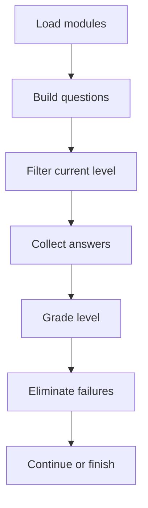

# LearningAssessmentPage.tsx

- Source: `Frontend/src/components/learn/LearningAssessmentPage.tsx`
- Kind: learner assessment route

## Story
This component renders the pre-test, post-test, and post-test-2 pages. It owns the current answer map, delegates question rendering to `BloomQuestionRenderer`, grades through `learningAssessments.ts`, and advances the adaptive Bloom pre-test by removing modules that fail the current level.

## Flow

## Boundary
- The normal submit path remains the source of truth for grading and persistence.
- Module elimination still runs through `eliminateModules()` from `AdaptiveAssessmentProvider`.
- The page does not own the question-bank shape; that stays in `learningAssessments.ts` and `learningModules.ts`.
- The page does not create any hidden answer bypass. Local testing still goes through the same visible assessment controls the learner uses.

## Acceptance Checks
- Wrong modules are removed from the active module pool after a pre-test level is submitted.
- The assessment UI stays readable when multiple questions are present.
- The current wrapper flow stays independent per question because the page only submits the rendered answer set.
