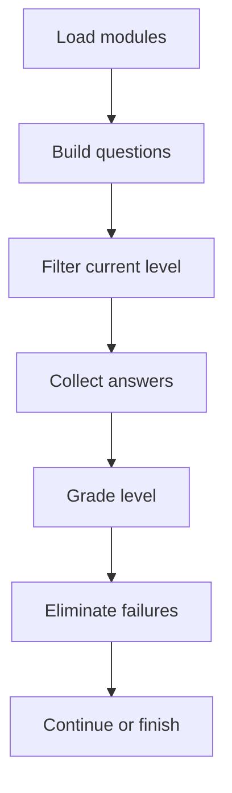
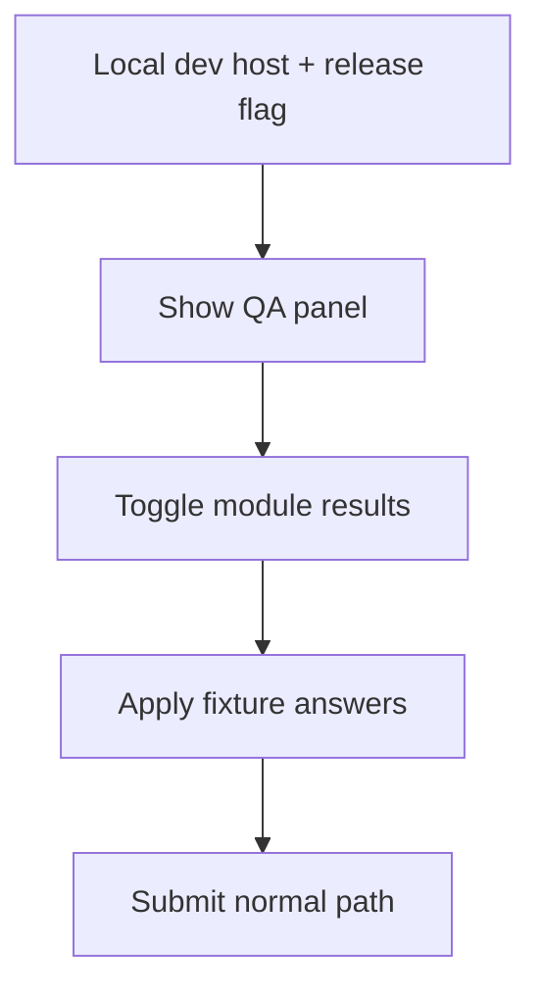

# LearningAssessmentPage.tsx

- Source: `Frontend/src/components/learn/LearningAssessmentPage.tsx`
- Kind: learner assessment route

## Story
This component renders the pre-test, post-test, and post-test-2 pages. It owns the current answer map, delegates question rendering to `BloomQuestionRenderer`, grades through `learningAssessments.ts`, and advances the adaptive Bloom pre-test by removing modules that fail the current level.

When the `assessment-dev-tools` feature release is enabled in the shared `isLocalDevRuntime()` gate, the page also exposes a compact QA panel that can mark current-level modules as pass or fail, apply fixture answers, and submit the level through the same normal persistence path.

## Flow

## Dev QA Flow

## Boundary
- The normal submit path remains the source of truth for grading and persistence.
- Module elimination still runs through `eliminateModules()` from `AdaptiveAssessmentProvider`.
- The page does not own the question-bank shape; that stays in `learningAssessments.ts` and `learningModules.ts`.
- The QA panel does not render unless `isLocalDevRuntime()` and the `assessment-dev-tools` release are both on.
- Studio questions still complete through the always-open embedded Studio frame rendered by `BloomQuestionRenderer`.
- In dev QA mode, `QA next` submits the current level, advances intermediate pre-test levels, and stops on the assessment page after the final submit; the explicit Continue button handles that handoff.

## Acceptance Checks
- Wrong modules are removed from the active module pool after a pre-test level is submitted.
- The assessment UI stays readable when multiple questions are present.
- The current wrapper flow stays independent per question because Studio completion comes from analyzer detection and the backend attaches wrapper identity per run result.
- Local dev can mark current modules as pass or fail and submit through the same grading path when the release flag is enabled.
