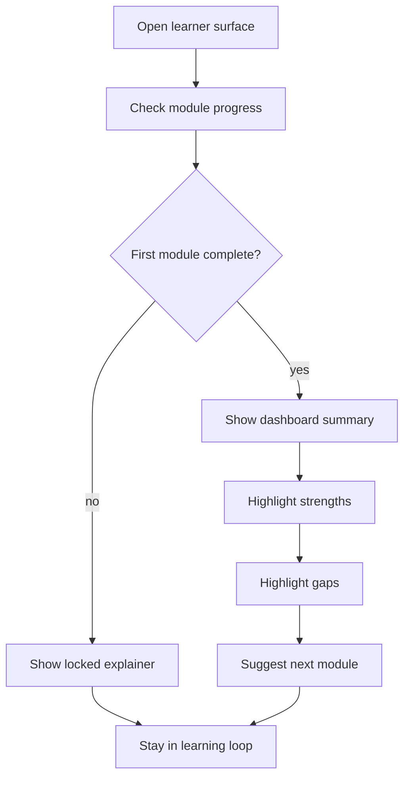

# learn

- Folder: docs/Codebase/Frontend/src/components/learn
- Owner: Frontend

## Logic Summary
Learner-facing progress surfaces that sit after the first module unlock. This folder owns the student dashboard, the unlock explanation, the progress summary cards, and the weak/strong area views that help a learner see where they are doing well and where they still need work.

## Ownership Boundary
This folder owns presentation, section ordering, and route-level guidance only. It must not own scoring rules, completion persistence, unlock writes, or analytics aggregation. Those belong to the learning backend and the progress API contract.

## Subsystem Story
Read `StudentDashboard.tsx.md` first. That file explains the post-completion dashboard surface, the lock state for first-time learners, and the score-summary layout.

## Folder Flow

## Documents By Logic
### Dashboard Surface
- `StudentDashboard.tsx.md` - post-unlock learner dashboard surface with a locked-first-entry state.

## Reading Hint
- Treat this folder as the learner-side companion to the module flow. The dashboard should never appear as a dead end; it should either explain why it is locked or show the next clear action.

