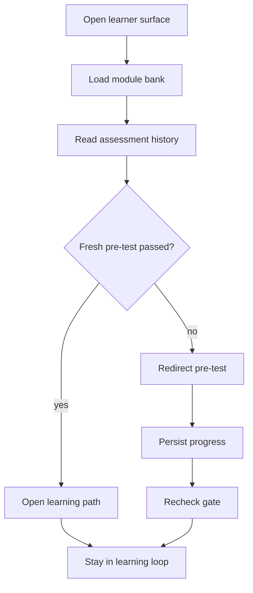

# learn

- Folder: docs/Codebase/Frontend/src/components/learn
- Owner: Frontend

## Logic Summary
Intern-facing progress and assessment surfaces that sit around the learning path. This folder owns the Intern Dashboard, the Pre-Test / Post-Test pages, the adaptive Pre-Test provider, mixed Bloom question rendering, the unlock explanation, and the summary cards that help an intern see where they are doing well and where they still need work.

## Ownership Boundary
This folder owns presentation, section ordering, route-level guidance, and pre-test page flow. Server freshness decisions and analytics aggregation stay behind the learning API contract, while learner pages may call the existing progress endpoint to persist completed and theory-passed module ids.

Fresh pre-test gating is server-backed:
- `LearningAssessmentPage` saves submitted pre-test answers through the learning assessments API.
- `PatternsLearnPage` reads saved assessment history before opening the learning path.
- Per-module pre-test outcomes separate modules already assigned to learning from modules exempted by full pre-test mastery.
- The local pre-test flag is only a convenience after a fresh saved attempt with recorded answers passes; it is not the source of truth after admin course edits.
- If the server reports no fresh passing pre-test, the learner is redirected to `/pre-test`.

## Subsystem Story
Read `InternDashboard.tsx.md` first. That file explains the post-Pre-Test home surface, score standing, and the shared next-gate layout.

## Folder Flow

## Documents By Logic
### Dashboard Surface
- `InternDashboard.tsx.md` - post-Pre-Test intern dashboard with required-module, Post-Test, and Studio gates.

### Assessment Gate
- `LearningAssessmentPage.tsx.md` - renders Pre-Test/Post-Test submission surfaces and routes each completed checkpoint to the correct intern gate.
- `BloomQuestionRenderer.tsx.md` - renders MCQ, identification, and always-open inline Studio theoretical questions from one mixed bank.
- `AdaptiveAssessmentProvider.tsx.md` - tracks the adaptive Bloom level and active module set when mirrored.
- `../marketing/patterns/PatternsLearnPage.tsx.md` - owns the learning-path gate that consumes server-backed pre-test evidence.
- `../../logic/pretestModuleOutcomes.ts.md` - derives per-module mastered levels, failed modules, and pre-test exemptions.

## Reading Hint
- Treat this folder as the learner-side companion to the module flow. The dashboard should never appear as a dead end; it should either explain why it is locked, show the next clear action, or send the learner back to a fresh pre-test when the course version has changed.
