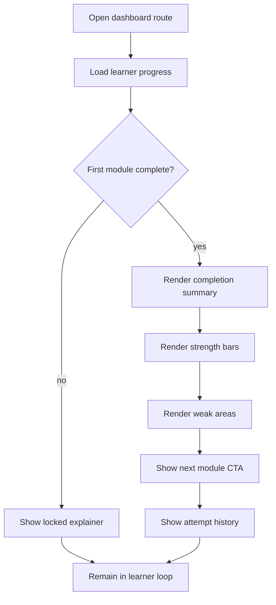

# `StudentDashboard.tsx`

## Sole job

Render the learner dashboard that appears only after the learner finishes the first full module. Before that unlock, the same surface should stay hidden from primary navigation and fall back to a locked explanation if reached directly.

## Layout Goal

The page should feel more like Canvas or TOPCIT than a generic analytics page:

- a clear module-completion summary at the top
- a compact strength / weak-area snapshot
- module progress bars that show what is done and what remains
- a next-step card that points back into the learning flow
- a history strip for recent attempts or checkpoints

The layout should answer three questions quickly:

1. What did the learner complete?
2. What is the learner good at?
3. What should the learner do next?

## Visibility Rule

- First-time learners do not see this surface in the primary nav.
- The dashboard unlocks after the first completed module.
- Direct access while locked shows a short explanation and a CTA back to the learning module.
- The lock state should not look like an error. It is a progress gate, not a failure state.

## Inspiration Boundary

Use the following ideas, not a literal clone:

- Canvas-style module progression: clear completion bars, sequential unlocks, and a next-requirement cue.
- TOPCIT-style score summary: score by module or skill area, with a readable comparison between strong and weak areas.

## Program Flow

## Surface Sections

### Completion Summary

This is the first thing the learner sees after unlock. It should show:

- completed module count
- current module completion state
- latest score or pass result
- current unlock position in the learning path

### Strength and Weakness Snapshot

Show a small set of skill buckets, not a wall of charts. Each bucket should answer whether the learner is:

- solid
- improving
- weak

Keep the labels plain and specific enough that the learner can act on them.

### Module Progress Bars

Use a module list or compact progress rail to show:

- finished modules
- in-progress modules
- locked future modules

The visual hierarchy should make the next unlocked module obvious.

### Next Action Card

The dashboard should always end with one strong next step, such as:

- continue the next module
- retry the last weak topic
- review the module result

## Implementation Note

- Derive the locked/unlocked state from the persisted progress snapshot, not from local-only UI state.
- Keep the dashboard out of the normal first-timer nav until the unlock condition is true.
- If the route is visited directly while locked, show the explain-and-return path instead of an empty analytics shell.

## Acceptance Checks

- A first-time learner does not see the dashboard in primary navigation.
- After the first completed module, the dashboard becomes available.
- The dashboard shows a readable strength / weakness split, not just raw numbers.
- Locked direct access explains why the dashboard is hidden and sends the learner back to the module flow.

