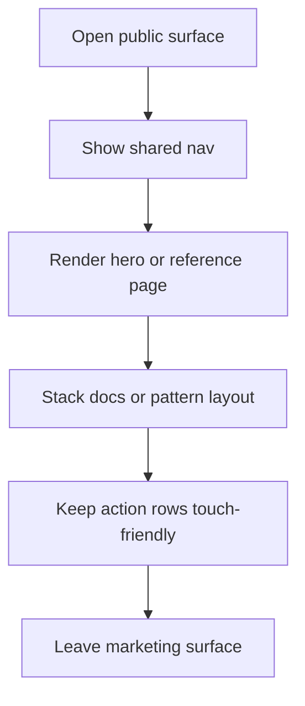

# marketing components

- Folder: docs/Codebase/Frontend/src/components/marketing
- Owner: Frontend

## Logic Summary
Public marketing and learning surfaces for NeoTerritory. This folder owns the shared marketing shell, the learn overview, the docs surface, the pattern catalog pages, and the small route wrappers that need to stay responsive on phone widths as well as desktop.

## Ownership Boundary
This folder owns presentation and routing glue only. It must not own analysis, pattern scoring, auth policy, or data persistence. Those concerns belong to the backend and the shared runtime stores.

## Reading Order
1. `HeroLanding.tsx.md` - home entry surface and first-viewport composition.
2. `AboutPage.tsx.md` - public company/about content.
3. `PatternsPage.tsx.md` - pattern catalog index and detail navigation.
4. `tour/TourPage.tsx.md` - guided overview of the product flow.
5. `research/ResearchPage.tsx.md` - research-facing marketing content.

## Responsive Contract

- The shared marketing nav should collapse into a mobile menu instead of compressing links into one line.
- Docs and pattern layouts should stack on narrow screens before any content starts to overflow horizontally.
- Pattern cards, docs sidebars, and popover panels should remain readable without a desktop-width viewport.
- The learn overview and student-learning entry shells should keep their action rows touch-friendly.

## Folder Flow

## Acceptance Checks

- The shared marketing nav can collapse without pushing the page wider than the viewport.
- Docs and pattern pages stay readable on mobile widths.
- Learn and public reference surfaces keep their primary actions visible without horizontal scrolling.
