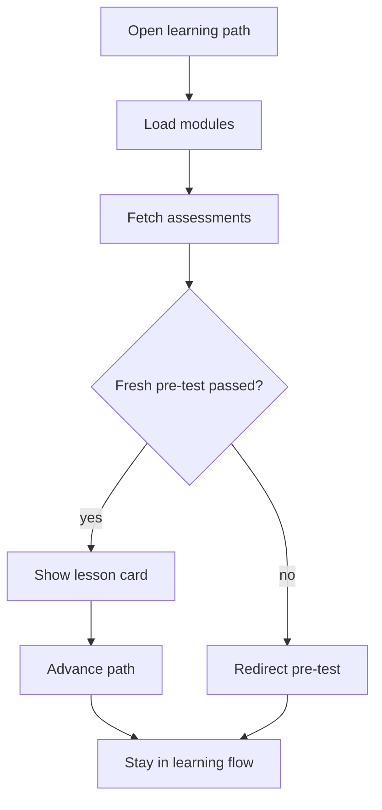

# `PatternsLearnPage.tsx`

## Sole job

Learning-path surface for the patterns curriculum. This page owns the section-level learning flow, the sidebar selection state, the progress/step tracking, the current lesson card, and the pre-test gate before the learner enters module content. It is not the patterns reference catalog and should not duplicate the catalog-style directory layout.

## Topbar Rule

- The page title `Learning Path` belongs in the topbar only.
- The main body must start directly with the learning card / content stack.
- Do not render a second title block inside the main content area.
- Do not add a subtitle or description under the title when the topbar already carries the page identity.
- The body hero wrapper currently shaped like `<section className="nt-course-hero" ...>` is the duplicate block to remove from the main flow.

## Layout Flow

### What the page should feel like

The user lands on a centered topbar title, then immediately enters the lesson body. The card area, sidebar highlight, and next/previous controls carry the rest of the interaction; the body should not compete with a second page header.

### Why this matters

The page already has nested learning state, so repeating `Learning Path` in the main section makes the layout feel split. Keeping the title in the topbar gives the content area a cleaner start and matches the compact learning-shell style used elsewhere.

## Program Flow

## Fresh Pre-Test Gate

- The page calls `fetchLearningAssessments()` for signed-in learners after the live module bank is loaded.
- It passes those attempts into `evaluateFoundationPretestFromAssessments(...)`.
- That helper ignores pre-test attempts older than the backend `courseUpdatedAt` value.
- A fresh passing pre-test can set the local `preTestCompleted` flag, but the server-backed attempt remains the durable gate.
- When the server read fails, the page marks assessment loading as failed and falls back to local state only long enough to keep the UI recoverable; the learner can still open the pre-test manually.

## Admin Reset Verification

The page must treat these admin changes as reset triggers because they bump the backend course timestamp:
- module create
- module full update
- module publish / auto-tag / sort-order patch
- module delete
- applied AI course plan, because applying the plan sends module publish patches

Preview-only AI plans must not reset learners. A preview only changes admin-local comparison state and should not make this page redirect a learner who already has a fresh pre-test.

## Reading Map

Read this file as: fresh pre-test gate first, then centered topbar title and direct-to-content learning shell.

Where it sits in the run: after the learner enters `/patterns/learn` or a nested module route.

Names worth recognizing while reading: assessment history, `courseUpdatedAt`, foundation evidence, centered topbar title, lesson card, sidebar highlight, and navigation arrows.

It leans on nearby contracts or tools such as the page shell layout and the existing learning-path state.

## Implementation Note

- Keep `Learning Path` in the topbar header only.
- Remove the same label from the main content tree.
- Delete the body-level `nt-course-hero` section instead of trying to hide it with CSS.
- Preserve the card and sidebar interaction; only move the heading placement.

## Acceptance Checks

- A stale saved pre-test redirects the learner to `/pre-test`.
- A fresh saved passing pre-test opens the lesson surface.
- Admin module create/update/patch/delete and applied AI plan changes are reflected through `courseUpdatedAt`.
- AI course plan preview alone does not reset the learner gate.
- The topbar shows a centered `Learning Path` title.
- The body does not repeat the same title.
- The first visible content under the header is the learning card or lesson panel.
- No `nt-course-hero` title block remains inside the main content area.
