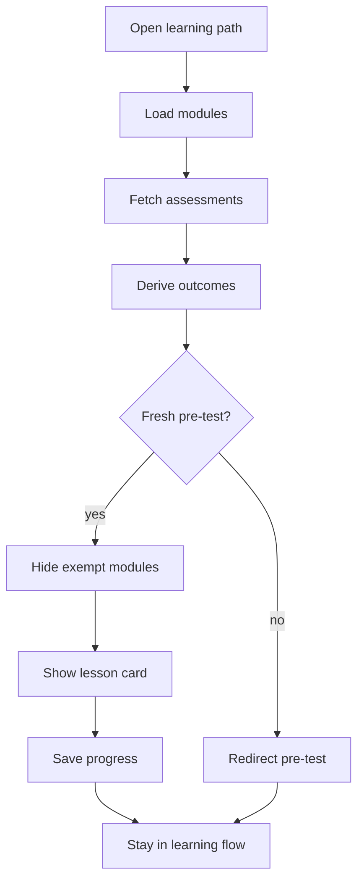

# `PatternsLearnPage.tsx`

## Sole job

Learning-path surface for the patterns curriculum. This page owns the section-level learning flow, the sidebar selection state, progress reads/writes through the learning API, the current lesson card, mixed theoretical question rendering, and the pre-test gate before the learner enters module content. It is not the patterns reference catalog and should not duplicate the catalog-style directory layout.

## Topbar Rule

- The page title `Learning Path` belongs in the topbar only.
- The main body must start directly with the learning card / content stack.
- Do not render a second title block inside the main content area.
- Do not add a subtitle or description under the title when the topbar already carries the page identity.
- The body hero wrapper currently shaped like `<section className="nt-course-hero" ...>` is the duplicate block to remove from the main flow.

## Layout Flow

### What the page should feel like

The user lands on a centered topbar title, then immediately enters the lesson body. The card area, sidebar highlight, and next/previous controls carry the rest of the interaction; the body should not compete with a second page header.

### Why this matters

The page already has nested learning state, so repeating `Learning Path` in the main section makes the layout feel split. Keeping the title in the topbar gives the content area a cleaner start and matches the compact learning-shell style used elsewhere.

## Program Flow

## Fresh Pre-Test Gate

- The page calls `fetchLearningAssessments()` for signed-in learners after the live module bank is loaded.
- It passes those attempts into `evaluateFoundationPretestFromAssessments(...)`.
- It also passes the same attempts into `derivePretestModuleOutcomes(...)` to learn which modules are failed, partially mastered, or fully exempt.
- That helper ignores pre-test attempts older than the backend `courseUpdatedAt` value.
- A fresh passing pre-test can set the local `preTestCompleted` flag, but the server-backed attempt remains the durable gate.
- When the server read fails, the page marks assessment loading as failed and falls back to local state only long enough to keep the UI recoverable; the learner can still open the pre-test manually.

## Personalized Module Path

- `fetchLearningProgress()` seeds completed and theory-passed module ids for the signed-in learner.
- `fetchLearningProgress()` also seeds `bloomMasteryByModule`, the per-user Bloom ceiling for each module.
- Completed modules, fully pre-test-exempt modules, and modules with Bloom mastery level 6 are removed from the learner-visible path.
- Mastered Bloom levels are threshold-based: a module mastery level of 5 removes levels 1 through 5 from that user's visible theory/practical question pages.
- Final theory-gate logic must use the filtered visible quiz pages, not the full authored question bank.
- `saveLearningProgress()` persists new theory-passed ids, completed ids, and Bloom mastery level 6 after full module completion.

## Practical Studio Flow

- Practical pages render the shared `StudioSurface` inline inside the lesson card; they do not use a textarea-only save bypass.
- A target-pattern detection saves the practical assessment record and completes the module when `passMode` is absent or `detection`.
- When `passMode` is `detection_and_tests`, detection only arms the gate; the embedded Studio Tests tab must pass before the practical save runs.
- The Studio remains visible before and after completion so the learner never has to click an "Open Studio" button or enter a modal overlay.
- When `isLocalDevRuntime()` is true, the embedded Studio can skip the practical through the same completion path when the `assessment-dev-tools` release is enabled.

## Admin Reset Verification

The page must treat these admin changes as reset triggers because they bump the backend course timestamp:
- module create
- module full update
- module publish / auto-tag / sort-order patch
- module delete
- applied AI course plan, because applying the plan sends module publish patches

Preview-only AI plans must not reset learners. A preview only changes admin-local comparison state and should not make this page redirect a learner who already has a fresh pre-test.

## Reading Map

Read this file as: fresh pre-test gate first, then personalized path filtering, then centered topbar title and direct-to-content learning shell.

Where it sits in the run: after the learner enters `/patterns/learn` or a nested module route.

Names worth recognizing while reading: assessment history, `courseUpdatedAt`, foundation evidence, pre-test module outcomes, progress snapshot, centered topbar title, lesson card, sidebar highlight, and navigation arrows.

It leans on nearby contracts or tools such as the page shell layout and the existing learning-path state.

## Implementation Note

- Keep `Learning Path` in the topbar header only.
- Remove the same label from the main content tree.
- Delete the body-level `nt-course-hero` section instead of trying to hide it with CSS.
- Preserve the card and sidebar interaction; only move the heading placement.
- Keep theoretical question rendering delegated to `BloomQuestionRenderer` so non-MCQ questions are not filtered out.

## Acceptance Checks

- A stale saved pre-test redirects the learner to `/pre-test`.
- A fresh saved passing pre-test opens the lesson surface.
- Completed and pre-test-exempt modules are hidden for that user.
- Bloom levels at or below the user's module mastery ceiling no longer show as quiz/practical pages for that module.
- A module with Bloom mastery level 6 is hidden for that user.
- The final visible theory page gates module completion after mastered levels are removed.
- Visible theory pages render MCQ, identification, and Studio questions through `BloomQuestionRenderer`.
- Studio creating questions can embed the analyzer surface in the lesson flow.
- Practical exam pages embed the analyzer surface and use detection/tests, not pasted text, as the completion signal.
- Admin module create/update/patch/delete and applied AI plan changes are reflected through `courseUpdatedAt`.
- AI course plan preview alone does not reset the learner gate.
- The topbar shows a centered `Learning Path` title.
- The body does not repeat the same title.
- The first visible content under the header is the learning card or lesson panel.
- No `nt-course-hero` title block remains inside the main content area.
