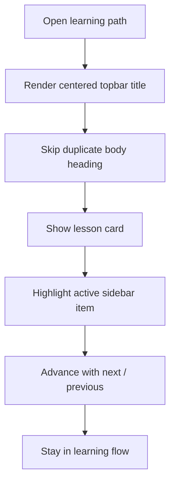

# `PatternsLearnPage.tsx`

## Sole job

Learning-path surface for the patterns curriculum. This page owns the section-level learning flow, the sidebar selection state, the progress/step tracking, and the current lesson card. It is not the patterns reference catalog and should not duplicate the catalog-style directory layout.

## Topbar Rule

- The page title `Learning Path` belongs in the topbar only.
- The main body must start directly with the learning card / content stack.
- Do not render a second title block inside the main content area.
- Do not add a subtitle or description under the title when the topbar already carries the page identity.

## Layout Flow

### What the page should feel like

The user lands on a centered topbar title, then immediately enters the lesson body. The card area, sidebar highlight, and next/previous controls carry the rest of the interaction; the body should not compete with a second page header.

### Why this matters

The page already has nested learning state, so repeating `Learning Path` in the main section makes the layout feel split. Keeping the title in the topbar gives the content area a cleaner start and matches the compact learning-shell style used elsewhere.

## Program Flow

## Reading Map

Read this file as: centered topbar title and direct-to-content learning shell.

Where it sits in the run: after the learner enters `/patterns/learn` or a nested module route.

Names worth recognizing while reading: centered topbar title, lesson card, sidebar highlight, and navigation arrows.

It leans on nearby contracts or tools such as the page shell layout and the existing learning-path state.

## Implementation Note

- Keep `Learning Path` in the topbar header only.
- Remove the same label from the main content tree.
- Preserve the card and sidebar interaction; only move the heading placement.

## Acceptance Checks

- The topbar shows a centered `Learning Path` title.
- The body does not repeat the same title.
- The first visible content under the header is the learning card or lesson panel.
