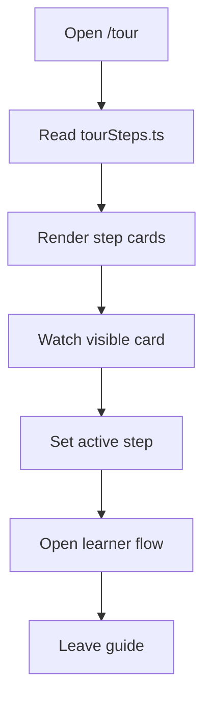

# `TourPage.tsx`

## Sole job

Show how the learner flow works, step by step, without requiring sign-in. This is the public walkthrough for the current learning-path UI: pre-test gate, centered learning-path header, leaf-level sidebar drill-down, green submit state on the final theory step, and server-scored post-test storage.

## Layout

- One section per step, scrollable single column.
- Each step: number, title, one paragraph, one screenshot or annotated diagram, one takeaway sentence.
- Top sticky `Step N of M` indicator derived from the visible step list.
- Bottom CTA: `Open learner flow`, which opens the learner chooser instead of hard-routing to a studio page.

## Steps

1. **Clear the pre-test gate** — the learner answers a baseline from module questions; only raw selections are saved.
2. **Enter the learning path** — the title sits in the centered topbar and the sidebar highlights the active leaf.
3. **Drill into a module** — categories fan into modules, then into Intro / Concepts / Examples / exam leaves.
4. **Pass the theoretical exam** — the final Next arrow becomes the submit action; scoring stays client-side.
5. **Finish the practical and post-tests** — practical checks stay embedded, and post-test flows store raw answers only.

## Content source

`Codebase/Frontend/src/components/marketing/tour/tourSteps.ts` exports the array of steps as a typed const. The same file is consumed by:

- `TourPage.tsx` (this file) — for the public route.
- Any future in-studio guide surface that wants the same wording.

Screenshots are stored under `Codebase/Frontend/public/tour/<step-slug>.png` and referenced via the `imagePath` field on each step.

## Flow

The page renders the source list directly and highlights the currently visible section through an `IntersectionObserver`.

## Hard rules

- No motion beyond the sticky indicator and the normal page scroll.
- Keep the wording aligned with the live learner UI. If the path changes, update `tourSteps.ts` first, then the page mirror.
- Screenshots are static PNG/JPG, never auto-generated, never animated.

## Route

`/tour` per D43. Not in top nav. Reached from the Home bento and the marketing footer.
