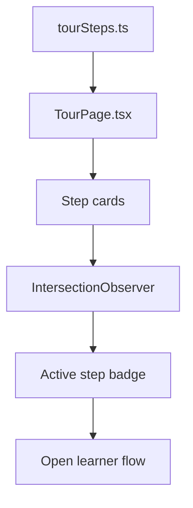

# `tourSteps.ts`

## Sole job

Provide the single source of truth for the public guide steps shown on `/tour`.
The live tour page reads this list directly, so any change in the learner flow should be reflected here first.

## Data Contract

- `TourStep.num`: the visible step number shown in the guide.
- `TourStep.slug`: the DOM anchor and screenshot lookup key.
- `TourStep.title`: the short step heading.
- `TourStep.paragraph`: the explanatory copy shown under the heading.
- `TourStep.takeaway`: the one-line summary of what the learner should remember.
- `TourStep.imagePath`: optional static screenshot path under `public/tour/`.

## Current Guide Shape

The current list mirrors the live learner UI:

1. Pre-test gate
2. Centered learning-path header and leaf highlight
3. Module drill-down from category to lesson leaf
4. Final theoretical submit state on the green Next arrow
5. Embedded practical checks and server-scored post-test storage

## Flow

Short summary: `TourPage.tsx` consumes this array, then uses the visible step to drive the sticky `Step N of M` indicator.

## Notes

- Keep this file and `TourPage.tsx` synchronized.
- Keep screenshots static; do not generate them dynamically.
- If the learning-path UI changes again, update the wording here before editing the page markup.
