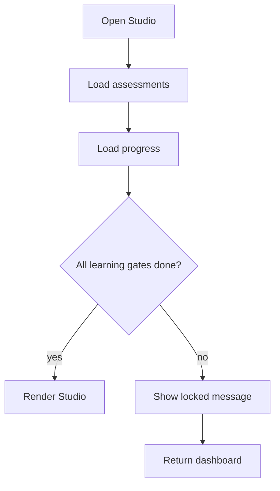

# `StudioApp.tsx`

## Sole job

Host the standalone Studio and enforce its intern-learning prerequisite. Admins keep their existing direct access; interns must finish the Pre-Test, every required module, and the paired Post-Test.

## Acceptance checks

- Signed-out visitors still route to sign-in.
- Admin access remains unchanged.
- Interns without a Pre-Test, required-module completion, or Post-Test see the gate.
- Eligible interns can open Studio from the Intern Dashboard.
