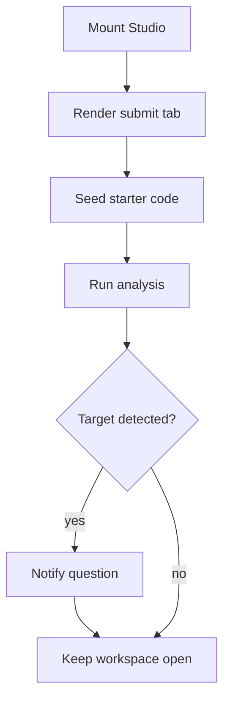

# `StudioSurface.tsx`

## Sole job

Render the interactive Studio workspace and coordinate analyzer output, tabs, tours, and embedded target-pattern checks. It is the shared surface used by the standalone Studio, learner Studio questions, and practical exam pages.

## Embedded Check Flow

## Learning Boundary

The surface accepts `targetPatternSlug`, optional target copy, an optional `starterCode`, an `onPatternDetected` callback, an optional local-dev `onSkip` hook, and an optional `showRunList` override. It does not grade Bloom levels or decide module completion. Embedded callers keep the frame mounted inline; this component does not own any modal or page-blur behavior. The skip hook only appears when a caller wires it through the localhost dev release flag.

Embedded assessment surfaces default the saved-runs list off. Standalone Studio keeps it on. This prevents a learner assessment from mounting the standalone run-history fetch and receiving an unrelated auth redirect while the learner is answering a Studio question.

## Acceptance Checks

- Starter code reaches the submit form for embedded Studio questions.
- Pattern detection callbacks fire when the target slug appears in analyzer results.
- Local dev can expose a small skip button, but only when `isLocalDevRuntime()` is true and the caller enables the dev-tools flag.
- Embedded Studio questions do not auto-load saved run history.
- Standalone Studio remains usable without target-pattern or starter-code props.
