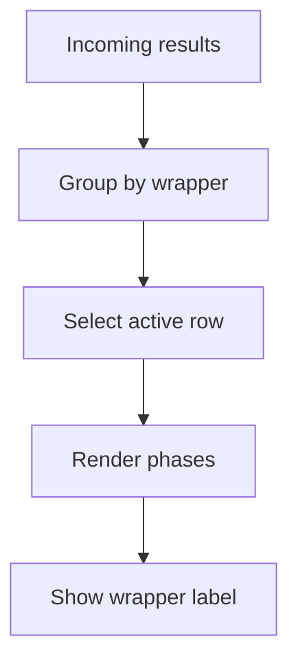

# GdbRunnerTab.tsx

- Source: `Frontend/src/components/tabs/GdbRunnerTab.tsx`
- Kind: GDB result viewer

## Story
This tab groups streamed test results by pattern, class, and wrapper id. The wrapper label is shown in the active detail panel so the user can tell apart isolated per-question instances even when they share the same Docker-backed user session.

## Read Order
1. `groupResults()` and `groupKeyOf()` for result grouping.
2. `runAll()` for streaming setup and live updates.
3. The tree render for the pattern/class navigation.

## Flow

## Boundary
- The tab does not invent wrapper ids; it only renders the id returned by the backend.
- The visual hierarchy stays family -> pattern -> class.
- Wrapper ids only surface where they help disambiguate runs.

## Acceptance Checks
- Streamed and cached results use the same grouping key.
- The active panel shows the wrapper label when one exists.
- The tree buttons still navigate by the current result identity.
