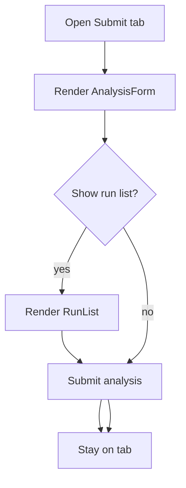

# `SubmitTab.tsx`

## Sole job

Host the Studio submit form and, when enabled, the recent run list for the Submit tab. It passes analysis callbacks down to `AnalysisForm` and keeps run-list refresh behavior tied to Studio-level state.

## Submit Flow

## Acceptance Checks

- `initialFile` is forwarded unchanged to `AnalysisForm`.
- `beforeAnalyze` still wraps the dispatch callback.
- Run-list refresh remains controlled by the parent Studio surface when `showRunList` is enabled.
- Embedded assessments can disable the run list while preserving the submit form.
