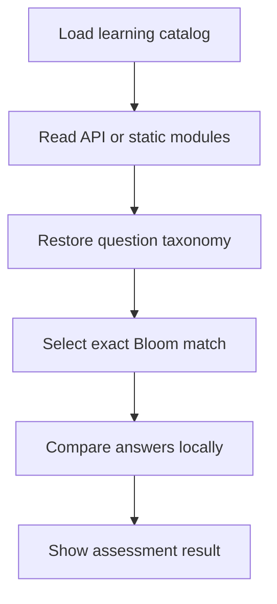

# `data`

- Folder: `docs/Codebase/Frontend/src/data`
- Future source folder: `Codebase/Frontend/src/data`

## Logic Summary
This folder owns the local learning catalog, the learner-facing assessment picker, and the hook that chooses between the API catalog and the bundled fallback catalog. It also owns the unit tests that keep the assessment taxonomy path honest.

## Ownership Boundary
This folder may infer, normalize, and select learning-question taxonomy in the browser. It must not invent server responses, persist scores, or change the backend schema. The API may omit taxonomy on seed-loaded modules; the frontend is responsible for restoring it before assessments read the catalog.

## Read Order
1. `learningModules.ts.md` explains how module questions are tagged and normalized.
2. `useLearningModules.ts.md` explains how the runtime source is normalized after API fetch or static fallback.
3. `learningAssessments.ts.md` explains how assessment paths demand exact Bloom matches.
4. `__tests__/learningAssessments.test.ts.md` explains the coverage that guards the taxonomy contract.

## Folder Flow

## Documents By Logic
- `learningModules.ts.md`: catalog tagging and normalization boundary.
- `useLearningModules.ts.md`: runtime source selection and normalization boundary.
- `learningAssessments.ts.md`: assessment path selection and foundation grading boundary.
- `__tests__/learningAssessments.test.ts.md`: taxonomy coverage and proficiency-persona checks.
