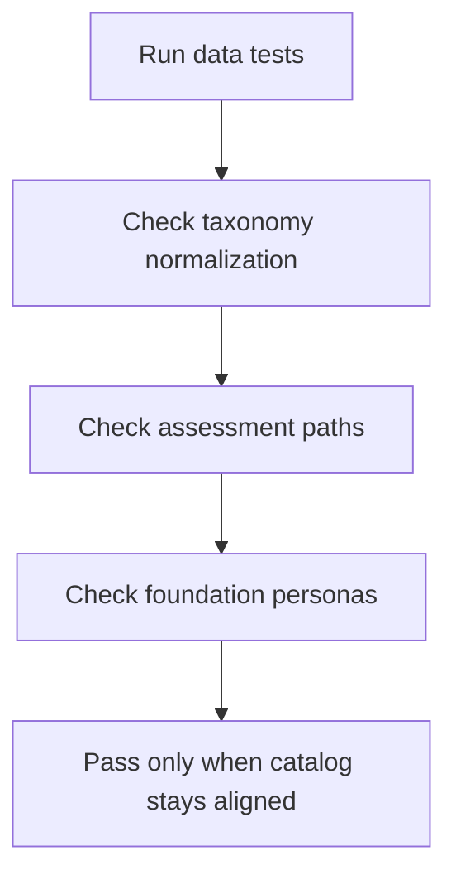

# `learningAssessments.test.ts`

## Sole job

This test file guards the browser-only learning assessment contract: taxonomy normalization, exact Bloom-path selection, and the foundation-pretest persona split.

## Coverage Map

## What the tests prove

- API-shaped modules with missing taxonomy are normalized back into the runtime catalog contract.
- Pre-test, post-test, and post-test-2 question sets match the requested Bloom path exactly.
- Foundation learners remain distinguishable as no knowledge, fundamentals only, some knowledge, or proficient.

## Ownership Boundary

These tests do not mock the backend or the assessment persistence layer. They stay inside the local catalog and grading logic so failures point directly at the browser-side contract.
